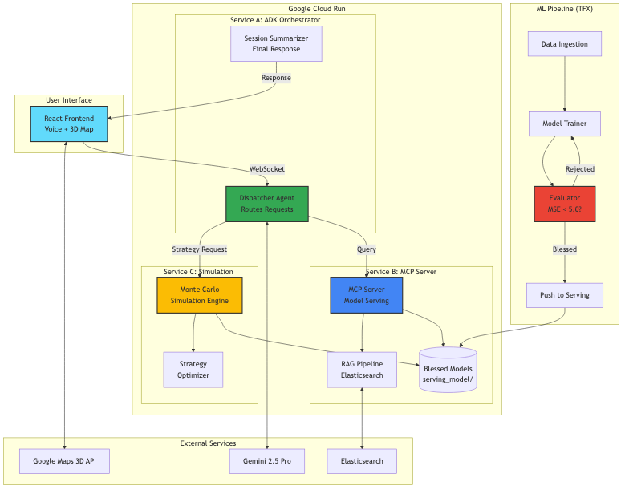
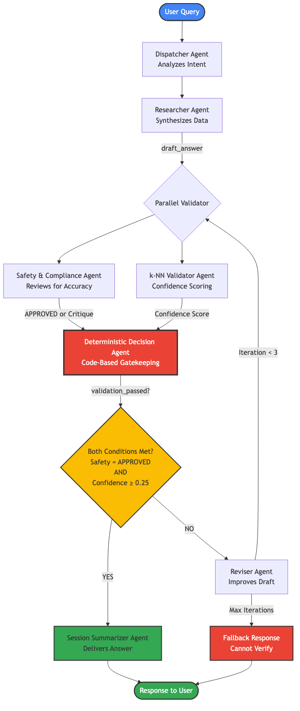
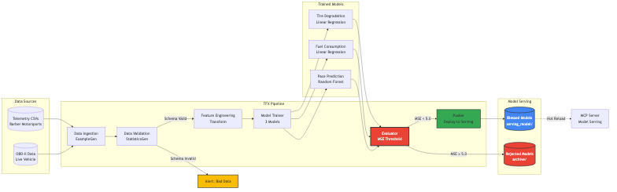
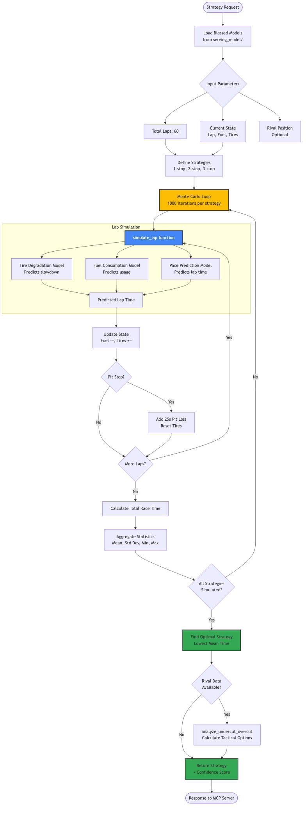
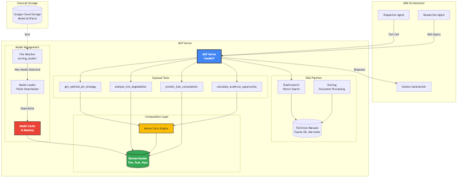
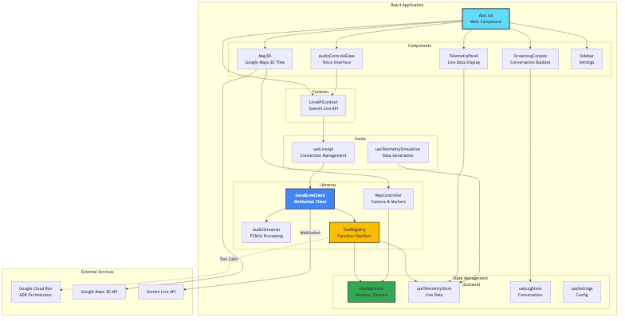
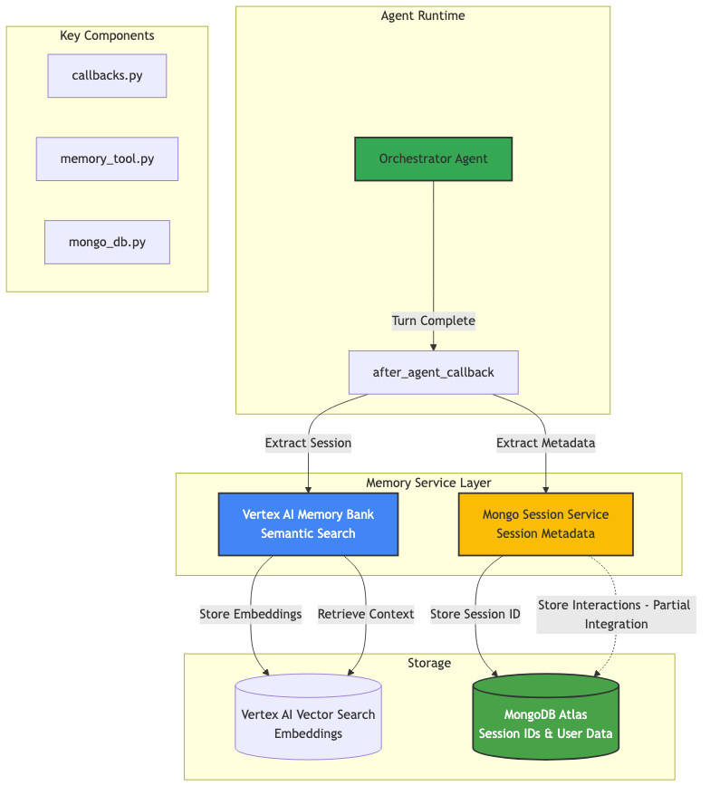
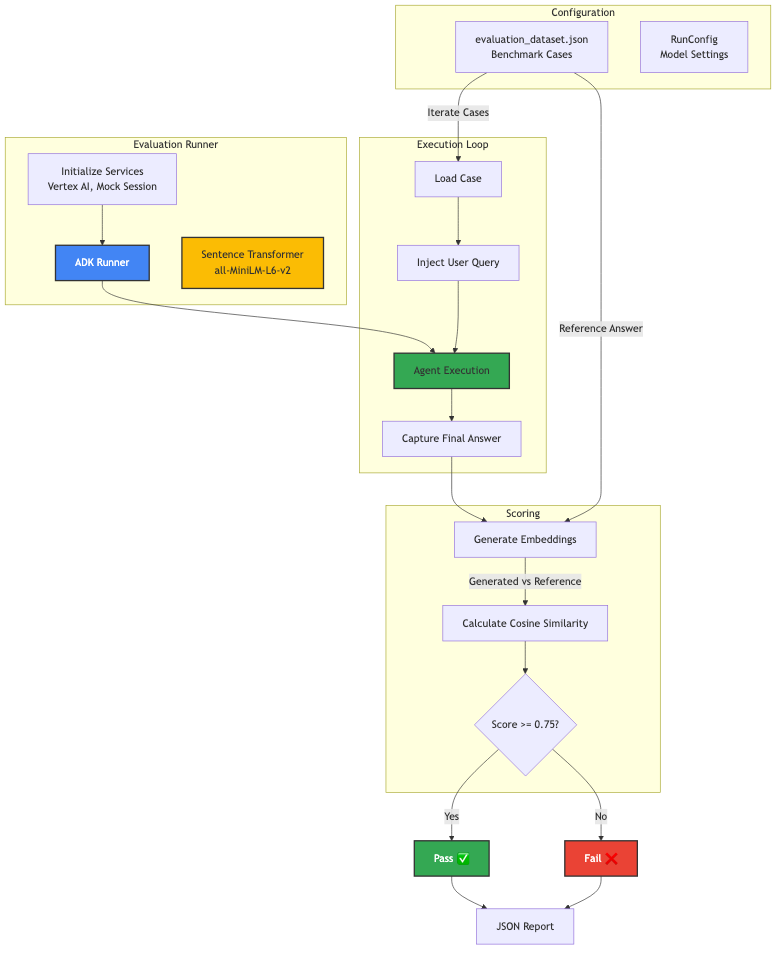
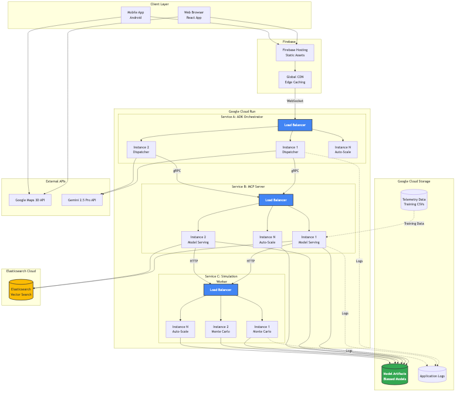

# 🏎️ Alora: The Multi-Agent Automotive Co-Pilot

**Deployed on Google Cloud Run | Built with Google Agent Development Kit (ADK)**

[](https://cloud.google.com/run)
[](https://developers.google.com/adk)
[](https://react.dev)

> **Mobile Development**: Android app development is ongoing at [mooncake](https://github.com/surfiniaburger/mooncake)

---

## 📖 Table of Contents

- [Vision](#-the-vision)
- [Architecture Overview](#-architecture-overview)
- [Services & Components](#-services--components-what-we-built)
- [Technical Deep Dive](#-technical-deep-dive)
- [Lessons Learned](#-lessons-learned)
- [Use Cases](#-use-case-toyota-gr-cup)
- [Tech Stack](#-tech-stack)
- [What's Next](#-whats-next)

---

## 💡 The Vision

Cars are becoming supercomputers, but the interface is stuck in the past. Whether you're a professional Race Engineer analyzing telemetry or a daily driver trying to understand a warning light, the data is locked away in screens and manuals. **We need a partner we can trust—one that guides us like instinct, keeping our focus on the road.**

### The Challenge

Traditional automotive interfaces fail to:
- Provide **real-time, context-aware guidance**
- Integrate **geospatial and mechanical data** seamlessly
- Deliver **mathematically verified** safety-critical information
- Offer **natural voice interaction** without distraction

### The Solution: Alora

Alora is a **Multi-Agent System** that breaks this barrier. It isn't just a chatbot; it's a digital crew sitting in the passenger seat (or the pit wall). It connects:

- 🗺️ **Google Maps 3D Tiles** (Geospatial awareness)
- 📊 **Live Telemetry** (Real-time vehicle data)
- 📚 **RAG Knowledge Bases** (Technical manuals & documentation)
- 🎙️ **Voice Interface** (Hands-free, eyes-on-road interaction)

All orchestrated through a **single, voice-controlled interface** with **mathematically enforced precision**.

---

## 🏗️ Architecture Overview

Alora implements a high-integrity, multi-agent workflow where **precision is mathematically enforced** through a "Trust but Verify" loop.



> See [Architecture Diagram](./docs/diagrams/architecture-overview.md) for interactive Mermaid version

### Core Principles

1. **Multi-Agent Collaboration**: Specialized agents handle distinct responsibilities
2. **Deterministic Validation**: Code-based gatekeeping ensures safety
3. **Continuous Learning**: TFX pipeline retrains models as new data arrives
4. **Serverless Scalability**: Cloud Run enables elastic compute

---

## 🛠️ Services & Components (What We Built)

### 1. **The Decision Engine** (Google ADK Multi-Agent System)

A sophisticated validation pipeline that ensures every AI response meets strict safety and accuracy criteria.



#### Components:

**a. ResearcherAgent**
- **Purpose**: Synthesizes external data from web searches and RAG contexts
- **Output**: Initial `draft_answer` based on retrieved knowledge
- **Tech**: Gemini 2.5 Pro, Elasticsearch, Docling

**b. ParallelValidator**
- **Purpose**: Simultaneous multi-dimensional validation
- **Components**:
  - **SafetyAndComplianceAgent**: Reviews for accuracy and safety (outputs "APPROVED" or critique)
  - **KnnValidatorAgent**: Vector-based confidence scoring using k-NN model trained on Mercedes/Automotive corpus
- **Threshold**: Technical confidence must meet **≥0.25** threshold

**c. DeterministicDecisionAgent**
- **Purpose**: Code-based gatekeeping (no LLM ambiguity)
- **Logic**: Sets `validation_passed = True` **only if**:
  - Safety check == "APPROVED" **AND**
  - Technical confidence ≥ 0.25
- **Why It Matters**: Removes probabilistic uncertainty from safety-critical decisions

**d. ReviserAgent**
- **Purpose**: Iteratively improves drafts that fail validation
- **Loop**: CritiqueAndRefineLoop continues until validation passes
- **Max Iterations**: 3 (prevents infinite loops)

**e. SessionSummarizerAgent**
- **Purpose**: Delivers final answer only after passing validation gauntlet
- **Output**: Natural language response to driver

---

### 2. **The ML Training Pipeline** (TensorFlow Extended)

An automated assembly line that trains, validates, and deploys ML models for race strategy.



#### Components:

**a. Trainer (`trainer.py`)**
- **Purpose**: The "Gym" where AI learns from telemetry data
- **Models Trained**:
  1. **Tire Degradation Model** (Linear Regression)
     - Inputs: Lap count, lateral G-force
     - Output: Predicted lap time slowdown
  2. **Fuel Consumption Model** (Linear Regression)
     - Inputs: RPM, throttle position
     - Output: Fuel usage per lap
  3. **Pace Prediction Model** (Random Forest)
     - Inputs: Traffic, gear, braking intensity
     - Output: Overall lap time prediction
- **Output**: Serialized models saved to `models/` directory

**b. Evaluator (`evaluator.py`)**
- **Purpose**: Quality Control inspector (prevents bad models from deployment)
- **Metric**: Mean Squared Error (MSE)
- **Decision Logic**:
  - MSE < 5.0 → Model "Blessed" ✅ (marked safe for production)
  - MSE ≥ 5.0 → Model rejected ❌ (system keeps old version)
- **Why It Matters**: Acts as a kill-switch for defective models

**c. Pipeline Orchestrator (`pipeline.py`)**
- **Purpose**: Ties the entire workflow together
- **Steps**:
  1. **Ingest**: Read raw telemetry CSVs (Barber Motorsports Park dataset)
  2. **Validate**: Check for missing data or anomalies
  3. **Transform**: Feature engineering (e.g., rolling averages)
  4. **Train**: Execute trainer
  5. **Evaluate**: Run evaluator
  6. **Push**: If blessed, copy to `serving_model/` directory
- **Automation**: Runs on schedule or triggered by new data

---

### 3. **The Strategy Brain** (Monte Carlo Simulation Engine)

Real-time race strategy optimization using statistical simulations.



#### Key Functions:

**a. `simulate_lap(lap_number, tire_wear, fuel_level)`**
- **Purpose**: Predicts lap time using trained ML models
- **Inputs**: Current lap, tire degradation %, fuel remaining
- **Output**: Predicted lap time (seconds)

**b. `run_strategy_simulation(pit_strategy)`**
- **Purpose**: Simulates entire race (e.g., 60 laps)
- **Process**:
  - Tracks fuel dropping lap-by-lap
  - Tracks tire wear accumulation
  - Accounts for pit stop time loss (~25 seconds)
- **Output**: Total race time for given strategy

**c. `find_optimal_pit_window()`**
- **Purpose**: Runs thousands of Monte Carlo simulations
- **Strategies Tested**: 1-stop, 2-stop, 3-stop
- **Output**: Statistically optimal pit lap (e.g., "Pit on Lap 28")

**d. `analyze_undercut_overcut(rival_position)`**
- **Purpose**: Tactical decision-making vs. competitors
- **Calculations**:
  - **Undercut**: Pit now to gain track position
  - **Overcut**: Stay out to preserve tire life
- **Output**: Recommended action with probability of success

---

### 4. **The MCP Server** (Model Context Protocol Interface)

The bridge between the mathematical engine and the Alora chatbot.



#### Responsibilities:

**a. Model Loading**
- Monitors `serving_model/` directory
- Automatically loads latest "Blessed" models
- Hot-reloads on new model deployment

**b. Tool Exposure**
- Wraps complex functions into LLM-callable tools:
  - `get_optimal_pit_strategy`
  - `analyze_tire_degradation`
  - `predict_fuel_consumption`
  - `calculate_undercut_opportunity`

**c. Request Handling**
- Receives requests from ADK Orchestrator
- Executes Monte Carlo simulations
- Returns structured JSON responses

**Example Flow**:
```
User: "When should I pit?"
  ↓
ADK Orchestrator → MCP Server
  ↓
MCP Server runs find_optimal_pit_window()
  ↓
Returns: { "strategy": "1-stop", "pit_lap": 28, "confidence": 0.87 }
  ↓
SessionSummarizerAgent: "I recommend a 1-stop strategy. Pit on Lap 28."
```

---

### 5. **The Frontend** (React + Google Maps 3D)

An immersive, voice-controlled interface with agent-driven UI.



#### Key Features:

**a. Agent-Driven UI**
- AI controls camera movements (e.g., "Show me Turn 10" → camera flies to location)
- Dynamic marker placement based on AI responses
- Real-time telemetry visualization

**b. 3D Map Integration**
- Google Maps 3D Tiles API
- Custom polylines for race track
- Car and ghost car markers with rotation

**c. Voice Interface**
- Gemini Live API for real-time audio streaming
- Hands-free operation
- Natural language understanding

**d. State Management**
- Zustand stores for reactive UI
- WebSocket streaming for live updates
- Optimistic UI updates

---

### 5. **Memory Service & Persistence**

Hybrid memory architecture combining semantic vector search with structured session metadata.



#### Components:
- **Vertex AI Memory Bank**: Stores conversation turns as vector embeddings for long-term semantic retrieval.
- **Mongo Session Service**: Manages session metadata (IDs, User IDs) in MongoDB Atlas.
  - *Note*: Interaction history storage in MongoDB is currently in partial integration/debug mode.
- **Callbacks**: `after_agent_callback` triggers memory persistence only for the Orchestrator agent to ensure consistency.

---

### 6. **Prompt Evaluation Pipeline**

Automated benchmarking system to validate agent performance against ground-truth datasets.



#### Workflow:
1. **Dataset**: JSON file containing user queries and reference answers.
2. **Execution**: Runs agent against each query using a `MockSessionService`.
3. **Scoring**: Uses `SentenceTransformer` (all-MiniLM-L6-v2) to calculate cosine similarity between generated and reference answers.
4. **Threshold**: Pass/Fail based on similarity score (default ≥ 0.75).

---

### 6. **Cloud Infrastructure** (Google Cloud Run)

Serverless, auto-scaling deployment architecture.



#### Services:

**Service A: ADK Orchestrator**
- **Purpose**: The "Brain" - routes requests to specialized agents
- **Tech**: Python, Google ADK
- **Scaling**: 0-100 instances based on load

**Service B: MCP Server**
- **Purpose**: The "Knowledge" - RAG pipeline + ML model serving
- **Tech**: FastMCP, Elasticsearch
- **Storage**: Google Cloud Storage for models

**Service C: Simulation Worker**
- **Purpose**: Heavy Monte Carlo computations
- **Tech**: Python, NumPy, Scikit-Learn
- **Optimization**: CPU-optimized instances

**Frontend: React App**
- **Hosting**: Firebase Hosting
- **CDN**: Global edge caching
- **WebSockets**: Real-time streaming via Cloud Run

---

## 🎓 Lessons Learned

### 1. **Trust but Verify: Deterministic Gatekeeping**

**What We Built**: DeterministicDecisionAgent with hard-coded validation thresholds

**Why It Matters**:
- LLMs are probabilistic; safety-critical systems need determinism
- Code-based validation removes ambiguity
- Mathematical thresholds (e.g., confidence ≥ 0.25) are auditable

**Lesson**: For automotive/safety applications, **never rely solely on LLM judgment**. Always have a deterministic layer.

---

### 2. **Continuous Training Prevents Model Drift**

**What We Built**: TFX pipeline with automated retraining

**Why It Matters**:
- Car performance changes (weather, tire compounds, track evolution)
- Static models become inaccurate over time
- Automated retraining keeps predictions fresh

**Lesson**: ML models in dynamic environments need **continuous learning pipelines**, not one-time training.

---

### 3. **The Evaluator as a Kill-Switch**

**What We Built**: `evaluator.py` with MSE threshold gating

**Why It Matters**:
- Bad training data can produce dangerous models
- Automated deployment without validation is risky
- MSE threshold acts as a safety net

**Lesson**: **Never auto-deploy ML models** without a validation gate. The cost of a bad model in production is too high.

---

### 4. **Agent Specialization > Monolithic LLM**

**What We Built**: Multi-agent system with specialized roles

**Why It Matters**:
- Single LLM tries to do everything → mediocre at all
- Specialized agents (Researcher, Validator, Reviser) excel at specific tasks
- Parallel validation reduces latency

**Lesson**: **Decompose complex problems** into agent-specific tasks. Orchestrate, don't monolithize.

---

### 5. **MCP Enables Modular Intelligence**

**What We Built**: MCP Server as a standalone service

**Why It Matters**:
- Chatbot doesn't need to know calculus
- ML models can be updated without touching chatbot code
- Clear separation of concerns

**Lesson**: Use **Model Context Protocol** to decouple AI reasoning from domain-specific computation.

---


### 6. **Voice Interfaces Need Visual Grounding**

**What We Built**: Agent-driven camera movements synced with voice responses

**Why It Matters**:
- "Turn 10" is abstract without visual context
- Camera flying to location creates spatial understanding
- Multimodal feedback (voice + visual) reduces cognitive load

**Lesson**: For automotive AI, **voice alone isn't enough**. Pair it with visual grounding.

---

### 7. **WebSockets > Polling for Real-Time Data**

**What We Built**: Gemini Live API with WebSocket streaming

**Why It Matters**:
- Polling creates latency and wastes bandwidth
- WebSockets enable true real-time updates
- Critical for live telemetry and race strategy

**Lesson**: For time-sensitive applications, **WebSockets are non-negotiable**.

---

## 🏁 Use Case: Toyota GR Cup (Hack the Track)

We tailored Alora's "Track Mode" specifically for the **Toyota GR Cup** racing series.

### Dual Grounding Strategy

**Geospatial Data (Google Maps)**:
- 3D visualization of Barber Motorsports Park
- Turn-by-turn navigation
- Elevation profiles

**Mechanical Data (Toyota Telemetry)**:
- Live tire health monitoring
- Fuel consumption tracking
- Lap delta vs. rival

### The "Ghost Car" Feature

**Concept**: Visualize the gap between driver and rival

**Implementation**:
- Rival's position rendered as translucent "ghost" marker
- Real-time gap calculation (seconds ahead/behind)
- Predictive trajectory based on pace difference

**Impact**: Drivers can **see** the competition, not just hear about it.

---

## 🚀 Accomplishments We're Proud Of

### 1. **Self-Correcting AI**
- TFX pipeline retrains models when performance changes (e.g., rain, engine degradation)
- Monte Carlo simulation automatically adjusts strategy
- No manual intervention required

### 2. **Safe Deployment**
- Evaluator acts as kill-switch for defective models
- Deterministic validation prevents unsafe advice
- Multi-layer safety checks (Safety Agent + k-NN + Code Gate)

### 3. **Modular Architecture**
- Chatbot, ML pipeline, and simulation engine are independent
- Each service can scale/update independently
- Clear contracts via MCP

### 4. **Immersive UX**
- Agent-driven camera movements
- Glassmorphic floating UI
- Voice + visual multimodal interaction

---

## 🛠️ Tech Stack

| Layer | Technology |
|-------|-----------|
| **Orchestration** | Google Agent Development Kit (ADK) |
| **Compute** | Google Cloud Run (Serverless) |
| **AI Models** | Gemini 2.5 Pro, Cohere (RAG) |
| **ML Pipeline** | TensorFlow Extended (TFX) |
| **Simulation** | Python, NumPy, Scikit-Learn |
| **Data** | Elasticsearch, Docling, Toyota TRD Dataset |
| **Frontend** | React 19.2, Google Maps 3D Tiles API |
| **State Management** | Zustand |

| **Voice** | Gemini Live API |
| **Hosting** | Firebase (Frontend), Cloud Run (Backend) |

---

## 🔮 What's Next

### Phase 1: Data Agents (Q1 2025)
- **Goal**: Automate data collection, ingestion, and user preference learning
- **Agents**:
  - **DataCollectorAgent**: Scrapes telemetry from OBD-II devices
  - **IngestionAgent**: Validates and normalizes data for TFX
  - **PreferenceAgent**: Learns driver style (aggressive vs. conservative)

### Phase 2: Android XR (Q2 2025)
- **Goal**: AR/VR-compatible app using Jetpack Compose
- **Features**:
  - Heads-up display on engineer's helmet visor
  - Spatial audio for directional cues
  - Gesture controls for hands-free operation

### Phase 3: Public Release (Q3 2025)
- **Google Play**: Consumer Android app
- **Meta Horizon**: VR experience for sim racing
- **Integration**: Voice-enabled dashboard for race engineers

---

## 📚 Documentation

- [Architecture Diagrams](./docs/diagrams/)
  - [Memory Service](./docs/diagrams/memory-service.md)
  - [Prompt Evaluation](./docs/diagrams/prompt-evaluation.md)
- [API Reference](./docs/api/)
- [Test Recommendations](./TEST_RECOMMENDATIONS.md)


---

## 📄 License

Apache 2.0 - See [LICENSE.md](./LICENSE.md)

---

**Built with ❤️ by the Alora Team**  
*Keeping your focus on the road, one intelligent conversation at a time.*
