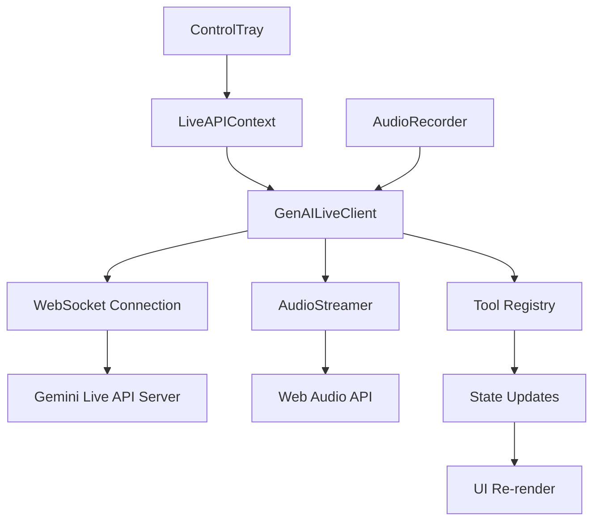
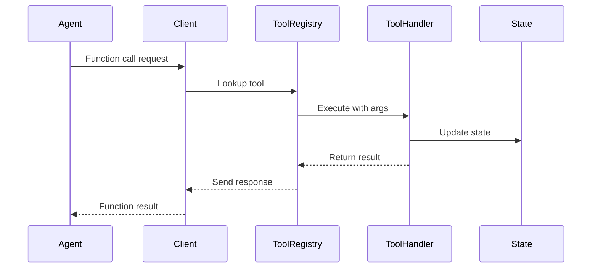

# Live API Integration Documentation

## Overview

Alora integrates with Google's **Gemini Live API** for real-time, multimodal conversations. The Live API enables voice-to-voice interactions with function calling capabilities, allowing the AI to control the application and interact with external services.

---

## Architecture

### Component Stack



---

## LiveAPIContext

**Location:** `contexts/LiveAPIContext.tsx`

**Purpose:** Provides Live API client and state to all components

**Provider Props:**
```typescript
interface LiveAPIProviderProps {
  apiKey: string;
  map: google.maps.maps3d.Map3DElement | null;
  placesLib: google.maps.PlacesLibrary | null;
  routesLib: google.maps.RoutesLibrary | null;
  elevationLib: google.maps.ElevationLibrary | null;
  geocoder: google.maps.Geocoder | null;
  padding: [number, number, number, number];
  children: React.ReactNode;
}
```

**Context Value:**
```typescript
interface LiveAPIContextValue {
  client: GenAILiveClient | null;
  connected: boolean;
  connect: () => Promise<void>;
  disconnect: () => void;
  audioStreamer: React.RefObject<AudioStreamer>;
}
```

**Usage:**
```tsx
// App.tsx
<LiveAPIProvider
  apiKey={API_KEY}
  map={map}
  placesLib={placesLib}
  routesLib={routesLib}
  elevationLib={elevationLib}
  geocoder={geocoder}
  padding={padding}
>
  {/* App components */}
</LiveAPIProvider>
```

```tsx
// Component
function ControlTray() {
  const { client, connected, connect, disconnect } = useLiveAPIContext();
  
  const handleMicClick = async () => {
    if (!connected) {
      await connect();
    } else {
      disconnect();
    }
  };
}
```

---

## GenAILiveClient

**Location:** `lib/genai-live-client.ts`

**Purpose:** WebSocket client for Gemini Live API

### Initialization

```typescript
const client = new GenAILiveClient({
  apiKey: API_KEY,
  model: 'gemini-2.5-flash-native-audio-preview-09-2025',
  systemPrompt: 'You are a helpful assistant...',
  tools: getToolRegistry('race'), // or 'ev'
  audioContext: audioContext({ id: 'main' })
});
```

### Configuration

```typescript
interface LiveClientConfig {
  apiKey: string;
  model: string;
  systemPrompt: string;
  tools: LiveServerToolDeclaration[];
  audioContext: AudioContext;
  generationConfig?: {
    temperature?: number;
    maxOutputTokens?: number;
    topP?: number;
  };
  voiceConfig?: {
    prebuiltVoiceConfig: {
      voiceName: string; // e.g., "Aoede"
    };
  };
}
```

### Connection Lifecycle

```typescript
// Connect
await client.connect();

// Send audio
client.sendRealtimeAudio(audioChunk);

// Send text
client.sendTextMessage('Hello, Alora!');

// Disconnect
client.disconnect();
```

### Event Handlers

```typescript
client.on('open', () => {
  console.log('WebSocket connected');
  setConnected(true);
});

client.on('message', (data) => {
  handleServerMessage(data);
});

client.on('audio', (audioChunk: ArrayBuffer) => {
  audioStreamer.current.addPCM16(new Int16Array(audioChunk));
});

client.on('close', (event: CloseEvent) => {
  console.log('WebSocket closed:', event.code);
  setConnected(false);
});

client.on('error', (error: Event) => {
  console.error('WebSocket error:', error);
});
```

---

## Audio Streaming

### Input: AudioRecorder

**Location:** `lib/audio-recorder.ts`

**Purpose:** Capture microphone audio and convert to PCM16

**Flow:**
```typescript
// 1. Get media stream
const stream = await navigator.mediaDevices.getUserMedia({ audio: true });

// 2. Create recorder
const audioRecorder = new AudioRecorder(audioContext);
recorder.start(stream);

// 3. Listen for data
audioRecorder.on('data', (chunk: ArrayBuffer) => {
  client.sendRealtimeAudio(chunk);
});

// 4. Stop recording
audioRecorder.stop();
```

**Implementation Details:**
- Sample rate: 16kHz (required by API)
- Format: PCM16 (16-bit linear PCM)
- Chunk size: ~100ms of audio

### Output: AudioStreamer

**Location:** `lib/audio-streamer.ts`

**Purpose:** Receive PCM16 from API and play via Web Audio

**Flow:**
```typescript
// 1. Create streamer
const audioStreamer = new AudioStreamer(audioContext);

// 2. Add chunks from API
audioStreamer.addPCM16(new Int16Array(chunk));

// 3. Audio plays automatically with buffering
```

**Buffering Strategy:**
- **Initial buffer:** 100ms before first playback
- **Look-ahead:** Schedule 200ms ahead
- **Sample rate:** 24kHz (API output)

**Volume Control:**
```typescript
audioStreamer.gainNode.gain.value = 1.0; // 0.0 to 1.0
```

---

## Tool Calling System

### Tool Declaration

**Format:**
```typescript
interface LiveServerToolDeclaration {
  function_declarations: [
    {
      name: string;
      description: string;
      parameters: JSONSchema; // Zod schema converted to JSON Schema
    }
  ];
}
```

**Example:**
```typescript
import { z } from 'zod';

export const findChargingStationsTool = {
  function_declarations: [
    {
      name: 'findEVChargingStations',
      description: 'Find nearby EV charging stations',
      parameters: {
        type: 'object',
        properties: {
          radiusMiles: {
            type: 'number',
            description: 'Search radius in miles'
          },
          minPowerKW: {
            type: 'number',
            description: 'Minimum charging power in kW'
          }
        },
        required: ['radiusMiles']
      }
    }
  ]
};
```

### Tool Execution Flow



**Implementation:**
```typescript
// 1. Client receives tool call from API
client.on('message', async (data) => {
  if (data.tool_call) {
    const { name, args } = data.tool_call;
    
    // 2. Execute tool
    const handler = toolRegistry[name];
    const result = await handler(args, toolContext);
    
    // 3. Send result back
    client.sendToolResult({
      tool_call_id: data.tool_call_id,
      result
    });
  }
});
```

### Tool Context

**Type:**
```typescript
interface ToolContext {
  map: google.maps.maps3d.Map3DElement | null;
  placesLib: google.maps.PlacesLibrary | null;
  routesLib: google.maps.RoutesLibrary | null;
  elevationLib: google.maps.ElevationLibrary | null;
  geocoder: google.maps.Geocoder | null;
  padding: [number, number, number, number];
}
```

**Usage in Tool:**
```typescript
export const myTool = implementTool({
  declaration: myToolDeclaration,
  handler: async (args, context) => {
    // Access Google Maps APIs
    const { placesLib, geocoder } = context;
    
    // Search for places
    const service = new placesLib.PlacesService(document.createElement('div'));
    const results = await searchPlaces(service, args.query);
    
    return { success: true, results };
  }
});
```

---

## System Prompt

### Dynamic Prompt Generation

**Location:** `lib/prompts.ts`

**Function:**
```typescript
export function getSystemPrompt(mode: 'race' | 'ev'): string {
  const basePrompt = `
You are Alora, a voice-first AI assistant for map-based interactions.

## Capabilities
- Control a 3D map interface
- Find locations and routes
- ${mode === 'ev' ? 'Find EV charging stations' : 'Analyze race telemetry'}

## Communication Style
- Concise and direct
- Use tool outputs instead of describing
- Don't mention UI components by name

## Tools
${getToolDescriptions(mode)}
  `.trim();
  
  return basePrompt;
}
```

**EV Mode Additions:**
```markdown
## EV Charging Assistant

You help users find electric vehicle charging stations.

**Workflow:**
1. Ask for vehicle details (make, model, current charge)
2. Get user location
3. Search for nearby stations
4. Present options with StationList
5. Help user navigate to chosen station
```

**Race Mode Additions:**
```markdown
## Race Strategy Assistant

You analyze telemetry data and provide racing insights.

**Workflow:**
1. Monitor real-time telemetry
2. Identify optimization opportunities
3. Suggest pit stop strategies
4. Provide lap time predictions
```

---

## Message Protocol

### Client → Server

**Audio Input:**
```json
{
  "realtime_input": {
    "media_chunks": [
      {
        "mime_type": "audio/pcm",
        "data": "<base64_encoded_pcm16>"
      }
    ]
  }
}
```

**Text Input:**
```json
{
  "clientContent": {
    "turns": [
      {
        "role": "user",
        "parts": [
          {
            "text": "Find charging stations near me"
          }
        ]
      }
    ],
    "turnComplete": true
  }
}
```

**Tool Result:**
```json
{
  "tool_response": {
    "function_responses": [
      {
        "id": "tool_call_123",
        "name": "findEVChargingStations",
        "response": {
          "success": true,
          "stationsFound": 5,
          "stations": [...]
        }
      }
    ]
  }
}
```

### Server → Client

**Audio Output:**
```json
{
  "serverContent": {
    "turnComplete": false,
    "modelTurn": {
      "parts": [
        {
          "inlineData": {
            "mimeType": "audio/pcm",
            "data": "<base64_encoded_pcm16>"
          }
        }
      ]
    }
  }
}
```

**Text Output:**
```json
{
  "serverContent": {
    "turnComplete": true,
    "modelTurn": {
      "parts": [
        {
          "text": "I found 5 charging stations near you."
        }
      ]
    }
  }
}
```

**Tool Call:**
```json
{
  "toolCall": {
    "functionCalls": [
      {
        "name": "findEVChargingStations",
        "id": "tool_call_123",
        "args": {
          "radiusMiles": 10
        }
      }
    ]
  }
}
```

---

## Error Handling

### Connection Errors

```typescript
try {
  await client.connect();
} catch (error) {
  console.error('Failed to connect:', error);
  
  useLogStore.getState().addTurn({
    role: 'system',
    text: `Connection error: ${error.message}. Please check your internet connection and API key.`,
    isFinal: true
  });
}
```

### Tool Execution Errors

```typescript
try {
  const result = await toolHandler(args, context);
  return result;
} catch (error) {
  console.error('[Tool Registry] Error:', error);
  
  return {
    success: false,
    error: error.message,
    toolName: toolName
  };
}
```

### Audio Errors

**Microphone Permission Denied:**
```typescript
try {
  const stream = await navigator.mediaDevices.getUserMedia({ audio: true });
} catch (error) {
  if (error.name === 'NotAllowedError') {
    alert('Microphone permission denied. Please enable it in your browser settings.');
  } else if (error.name === 'NotFoundError') {
    alert('No microphone found. Please connect a microphone and try again.');
  }
}
```

**AudioContext Suspended (Mobile):**
```typescript
if (audioContext.state === 'suspended') {
  console.log('Resuming AudioContext...');
  await audioContext.resume();
}
```

---

## Performance Optimization

### Audio Buffering

**Strategy:**
- Buffer 100ms before playing first chunk
- Schedule audio 200ms ahead
- Smooth playback without gaps

**Implementation:**
```typescript
class AudioStreamer {
  private bufferDuration = 0.1; // 100ms
  private scheduledTime = 0;
  
  addPCM16(chunk: Int16Array) {
    const buffer = this.convertToAudioBuffer(chunk);
    
    if (this.scheduledTime === 0) {
      this.scheduledTime = this.context.currentTime + this.bufferDuration;
    }
    
    this.scheduleBuffer(buffer, this.scheduledTime);
    this.scheduledTime += buffer.duration;
  }
}
```

### WebSocket Optimization

**Reconnection with Backoff:**
```typescript
let reconnectAttempts = 0;
const maxAttempts = 5;

const reconnect = () => {
  if (reconnectAttempts >= maxAttempts) {
    console.error('Max reconnection attempts reached');
    return;
  }
  
  const delay = Math.min(1000 * Math.pow(2, reconnectAttempts), 10000);
  reconnectAttempts++;
  
  setTimeout(() => {
    client.connect();
  }, delay);
};

client.on('close', (event) => {
  if (event.code !== 1000) { // Not normal closure
    reconnect();
  }
});
```

### Message Batching

**Batch small audio chunks:**
```typescript
const audioBatch: ArrayBuffer[] = [];
const BATCH_SIZE = 3;

audioRecorder.on('data', (chunk) => {
  audioBatch.push(chunk);
  
  if (audioBatch.length >= BATCH_SIZE) {
    const combined = concatenateBuffers(audioBatch);
    client.sendRealtimeAudio(combined);
    audioBatch.length = 0;
  }
});
```

---

## Testing

### Mock Client

```typescript
// __tests__/mocks/mock-live-client.ts
export class MockGenAILiveClient {
  private handlers: Map<string, Function[]> = new Map();
  
  on(event: string, handler: Function) {
    if (!this.handlers.has(event)) {
      this.handlers.set(event, []);
    }
    this.handlers.get(event)!.push(handler);
  }
  
  emit(event: string, data: any) {
    const handlers = this.handlers.get(event) || [];
    handlers.forEach(h => h(data));
  }
  
  async connect() {
    this.emit('open', {});
  }
  
  sendRealtimeAudio(chunk: ArrayBuffer) {
    // Simulate server response
    setTimeout(() => {
      this.emit('audio', chunk); // Echo back
    }, 100);
  }
}
```

### Integration Tests

```typescript
describe('Live API Integration', () => {
  it('connects and receives audio', async () => {
    const client = new MockGenAILiveClient();
    const audioReceived = jest.fn();
    
    client.on('audio', audioReceived);
    await client.connect();
    
    const testChunk = new ArrayBuffer(1024);
    client.sendRealtimeAudio(testChunk);
    
    await waitFor(() => {
      expect(audioReceived).toHaveBeenCalled();
    });
  });
});
```

---

## API Limits & Quotas

### Rate Limits (as of 2024)

- **Requests per minute:** 60
- **Tokens per minute:** 30,000
- **Concurrent connections:** 5

### Best Practices

1. **Caching:** Cache tool results when possible
2. **Debouncing:** Don't send audio too frequently
3. **Compression:** Use efficient audio formats
4. **Graceful degradation:** Handle rate limit errors

---

## Security

### API Key Management

**Environment Variable:**
```bash
VITE_API_KEY=your_api_key_here
```

**Access:**
```tsx
const API_KEY = import.meta.env.VITE_API_KEY;
```

**Production:**
- Use backend proxy for API key
- Never expose API key in client code
- Rotate keys regularly

### Input Validation

**Zod schemas for tool arguments:**
```typescript
const argsSchema = z.object({
  radiusMiles: z.number().min(1).max(50),
  minPowerKW: z.number().optional()
});

const validatedArgs = argsSchema.parse(args);
```

### Output Sanitization

**Prevent XSS in markdown:**
```tsx
<ReactMarkdown
  remarkPlugins={[remarkGfm]}
  components={{
    a: ({ node, ...props }) => <a {...props} rel="noopener noreferrer" />
  }}
>
  {content}
</ReactMarkdown>
```

---

## Debugging

### Enable Verbose Logging

```typescript
// Set in LiveAPIProvider
const DEBUG = true;

if (DEBUG) {
  client.on('message', (data) => {
    console.log('[Live API] Received:', JSON.stringify(data, null, 2));
  });
  
  client.on('send', (data) => {
    console.log('[Live API] Sent:', JSON.stringify(data, null, 2));
  });
}
```

### Debug Panel Integration

```typescript
console.log('[Tool Registry] Executing:', toolName);
// Captured by DebugPanel's console.log interceptor
```

### Network Inspection

**Chrome DevTools:**
1. Open DevTools → Network tab
2. Filter: WS (WebSocket)
3. Click on connection
4. View frames (messages)

---

## Future Enhancements

- [ ] Support for streaming text responses
- [ ] Multi-turn function calling
- [ ] Image input support
- [ ] Speech-to-text fallback
- [ ] Offline mode with local model
- [ ] Custom voice training
- [ ] Multi-language support

---

## Resources

- [Gemini Live API Docs](https://ai.google.dev/api/multimodal-live)
- [Web Audio API Guide](https://developer.mozilla.org/en-US/docs/Web/API/Web_Audio_API)
- [WebSocket API](https://developer.mozilla.org/en-US/docs/Web/API/WebSocket)
