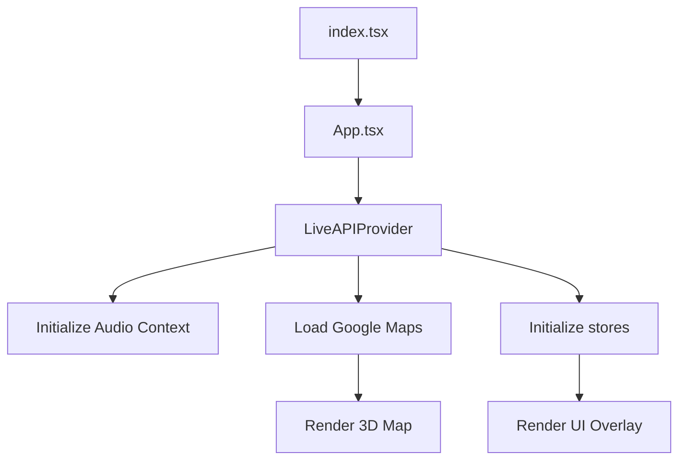
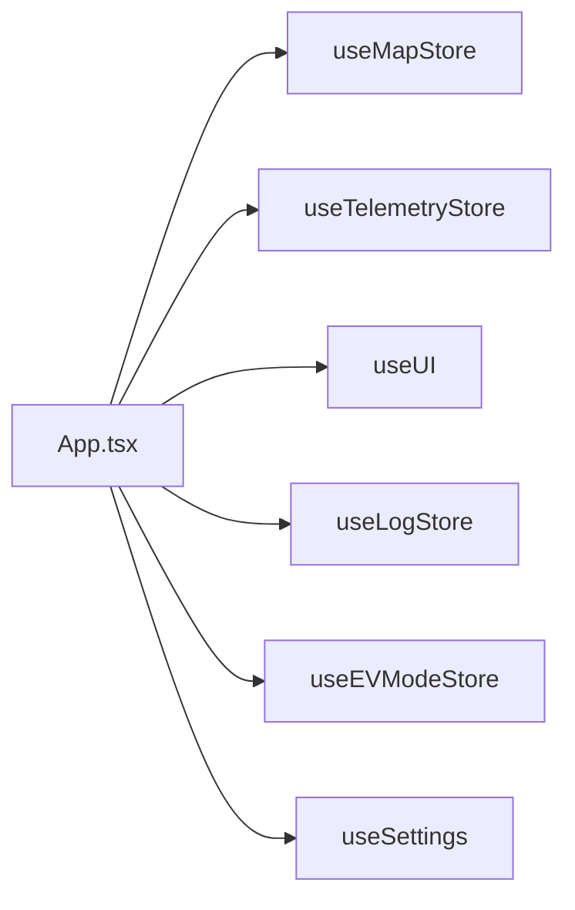
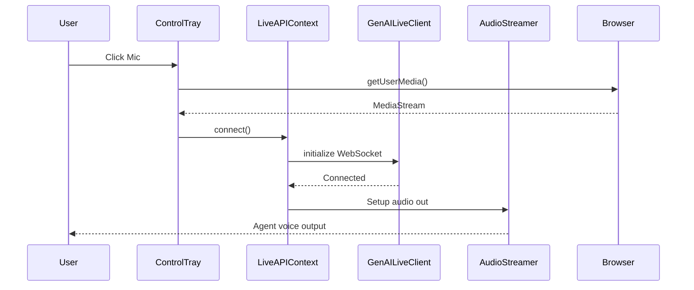
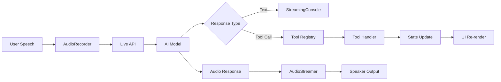
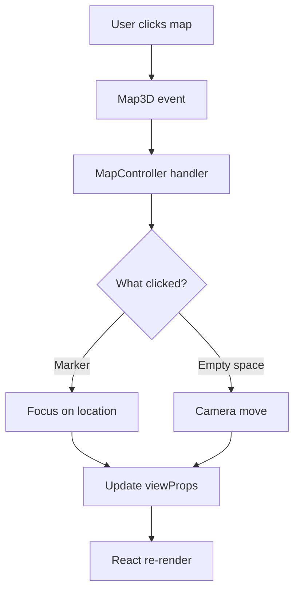

# Alora Architecture Documentation

## Overview

Alora is a React-based voice-enabled AI assistant application designed for map-centric interactions. It features a 3D Google Maps interface with floating HUD overlays and integrates with Google's Live API for real-time conversational AI.

---

## Technology Stack

### Core Framework
- **React 19.2.0**: UI framework
- **TypeScript 5.8.2**: Type safety
- **Vite 6.4.1**: Build tool and dev server

### State Management
- **Zustand 5.0.5**: Lightweight state management

### Maps & Location
- **@vis.gl/react-google-maps 1.5.5**: 3D Maps wrapper
- **Google Maps Platform APIs**:
  - Maps JavaScript API (3D)
  - Places API
  - Directions/Routes API
  - Geocoding API
  - Elevation API

### AI & Voice
- **@google/genai 1.4.0**: Live API SDK
- **Web Audio API**: Audio streaming
- **MediaDevices API**: Microphone access

### Animation
- **GSAP 3.x**: Advanced animations
- **@gsap/react**: React integration

### Mobile
- **Capacitor 7.4.4**: Native mobile wrapper
  - Android support
  - iOS support
  - Geolocation plugin

### Utilities
- **classnames**: Conditional CSS classes
- **react-markdown**: Markdown rendering
- **remark-gfm**: GitHub Flavored Markdown
- **lodash**: Utility functions
- **zod**: Schema validation

### Development
- **Vitest 4.0.14**: Unit testing
- **@testing-library/react 16.3.0**: Component testing
- **jsdom 27.2.0**: DOM testing environment

---

## Project Structure

```
Alora/
├── components/           # React components
│   ├── telemetry/       # Racing telemetry UI
│   ├── ev/              # EV charging components
│   ├── streaming-console/  # Chat interface
│   └── *.tsx            # Core UI components
├── lib/                 # Core libraries
│   ├── state/          #Zustand stores
│   ├── tools/          # AI tool registry
│   ├── map-controller.ts
│   ├── audio-streamer.ts
│   └── genai-live-client.ts
├── hooks/               # Custom React hooks
├── contexts/            # React contexts
│   └── LiveAPIContext.tsx
├── android/             # Android native project
├── ios/                 # iOS native project
├── public/              # Static assets
├── docs/                # Documentation
├── __tests__/           # Unit tests
├── App.tsx              # Root component
├── index.tsx            # App entry point
└── index.css            # Global styles
```

---

## Application Flow

### 1. Initialization



**Entry Point:** `index.tsx`
```tsx
import App from './App';
import { createRoot } from 'react-dom/client';

const root = createRoot(document.getElementById('root')!);
root.render(<App />);
```

**Root Component:** `App.tsx`
- Initializes Google Maps libraries
- Sets up LiveAPIProvider
- Orchestrates layout (map + UI overlay)
- Manages global state subscriptions

### 2. State Management Architecture

**Zustand Stores Pattern:**

```typescript
// lib/state/*.ts
import { create } from 'zustand';

export const useStore = create<StoreState>((set, get) => ({
  // State
  value: initialValue,
  
  // Actions
  setValue: (newValue) => set({ value: newValue }),
  
  // Computed/getters
  getComputed: () => {
    const state = get();
    return computeValue(state.value);
  }
}));
```

**Store Hierarchy:**



### 3. Live API Integration

**Connection Flow:**



**Data Flow:**

1. **Audio In:** Mic → AudioRecorder → GenAILiveClient → WebSocket
2. **Audio Out:** WebSocket → GenAILiveClient → AudioStreamer → Speakers
3. **Text/Tools:** WebSocket ← → GenAILiveClient → Tool Registry → State Updates → UI

---

## Core Systems

### Map Controller

**Location:** `lib/map-controller.ts`

**Responsibilities:**
- Manage 3D map camera
- Add/remove markers
- Draw polylines/polygons
- Handle map clicks
- Set altitude tilt

**Key Methods:**
```typescript
class MapController {
  flyTo(lat: number, lng: number, altitude?: number): void
  addMarker(position: LatLng, content: string): Marker3DElement
  drawPolyline(path: LatLng[], color: string): Polyline3DElement
  drawPolygon(coordinates: LatLng[], fill: string): Polygon3DElement
  clearMarkers(): void
  setDefaultTilt(): void
}
```

**Integration:**
```tsx
// App.tsx
const mapController = useRef<MapController | null>(null);

useEffect(() => {
  if (map && maps3dLib && elevationLib) {
    mapController.current = new MapController({
      map,
      maps3dLib,
      elevationLib
    });
  }
}, [map, maps3dLib, elevationLib]);
```

### Audio System

**Components:**

1. **AudioRecorder** (`lib/audio-recorder.ts`)
   - Captures microphone input
   - Converts to PCM16 format
   - Emits audio data chunks

2. **AudioStreamer** (`lib/audio-streamer.ts`)
   - Receives PCM16 from server
   - Converts to Float32 for Web Audio
   - Buffers and schedules playback
   - Manages volume and effects

3. **audioContext Utility** (`lib/utils.ts`)
   - Singleton AudioContext factory
   - Handles browser compatibility
   - Manages state (suspended/running)

**Audio Flow:**
```
Microphone → getUserMedia() → AudioRecorder → PCM16 chunks
→ WebSocket → Server → AI Processing → WebSocket
→ GenAILiveClient → AudioStreamer → Web Audio → Speakers
```

### Tool Registry

**Location:** `lib/tools/tool-registry.ts`

**Purpose:** Dynamic function calling based on application mode

**Architecture:**
```typescript
export function getToolRegistry(mode: 'race' | 'ev'): LiveServerToolDeclaration[] {
  if (mode === 'ev') {
    return [
      EVToolDeclarations.setEVVehicleProfile,
      EVToolDeclarations.findEVChargingStations,
      EVToolDeclarations.showRouteToStation
    ];
  } else {
    return [
      RaceToolDeclarations.analyzeTelemetry,
      RaceToolDeclarations.suggestStrategy
      // ...
    ];
  }
}
```

**Tool Implementation Pattern:**
```typescript
export const myTool = implementTool({
  declaration: {
    name: 'myTool',
    description: 'What this tool does',
    parameters: zodSchema
  },
  handler: async (args, context: ToolContext) => {
    // 1. Validate arguments (Zod handles this)
    // 2. Perform action (API call, state update, etc.)
    // 3. Return result
    return {
      success: true,
      data: result
    };
  }
});
```

**Tool Context:**
```typescript
interface ToolContext {
  map: google.maps.maps3d.Map3DElement | null;
  placesLib: google.maps.PlacesLibrary | null;
  routesLib: google.maps.RoutesLibrary | null;
  elevationLib: google.maps.ElevationLibrary | null;
  geocoder: google.maps.Geocoder | null;
  padding: [number, number, number, number];
}
```

---

## Rendering Strategy

### Layout System

**Full-Screen Map Architecture:**

```html
<div class="app-container">
  <!-- Map fills entire viewport -->
  <div class="map-background">
    <Map3D />
  </div>
  
  <!-- UI floats above map -->
  <div class="ui-overlay">
    <TelemetryPanel />
    <StreamingConsole />
    <ControlTray />
  </div>
</div>
```

**CSS Strategy:**
```css
.app-container {
  position: relative;
  width: 100vw;
  height: 100vh;
  overflow: hidden;
}

.map-background {
  position: absolute;
  inset: 0;
  z-index: 0;
}

.ui-overlay {
  position: absolute;
  inset: 0;
  z-index: 10;
  pointer-events: none; /* Allow clicks through to map */
}

.ui-overlay > * {
  pointer-events: auto; /* Re-enable for interactive elements */
}
```

### Pointer Events Model

**Problem:** UI overlays block map interactions

**Solution:** Selective pointer-events

- **Containers:** `pointer-events: none` (click-through)
- **Interactive children:** `pointer-events: auto` (capture clicks)

**Example:**
```tsx
<div className="ui-overlay"> {/* pointer-events: none */}
  <div className="telemetry-panel"> {/* pointer-events: auto */}
    Speed: 120 MPH
  </div>
</div>
```

### Responsive Design

**Breakpoints:**
- **Mobile:** `@media (max-width: 768px)`
- **Landscape:** `@media (orientation: landscape) and (max-height: 768px)`

**Mobile Adaptations:**
- Horizontal carousels for lists
- Larger touch targets (min 48px)
- Bottom-anchored controls
- Reduced glassmorphic blur (performance)

---

## Data Flow Patterns

### 1. Voice Command Flow



### 2. Map Interaction Flow



### 3. State Update Flow

```mermaid
flowchart LR
    A[Tool Handler] --> B[useStore.getState()]
    B --> C[set/update function]
    C --> D[Zustand internal]
    D --> E[Notify subscribers]
    E --> F[Component re-render]
    F --> G[UI update]
```

**Example:**
```tsx
// Tool handler
export const updateTelemetry = implementTool({
  handler: async (args) => {
    useTelemetryStore.getState().setData(args);
    return { success: true };
  }
});

// Component (auto re-renders on state change)
function TelemetryPanel() {
  const data = useTelemetryStore(state => state.data);
  return <div>{data.speed} MPH</div>;
}
```

---

## Performance Optimizations

### 1. Lazy Loading

```tsx
// Defer heavy components
const HeavyComponent = lazy(() => import('./HeavyComponent'));

function App() {
  return (
    <Suspense fallback={<Loading />}>
      <HeavyComponent />
    </Suspense>
  );
}
```

### 2. Memoization

```tsx
// Expensive calculations
const memoizedValue = useMemo(() => {
  return computeExpensiveValue(a, b);
}, [a, b]);

// Callback functions
const memoizedCallback = useCallback(() => {
  doSomething(a, b);
}, [a, b]);
```

### 3. Audio Buffering

**AudioStreamer** uses:
- **Initial buffer:** 100ms before playback starts
- **Look-ahead scheduling:** 200ms
- **Chunk size:** 7680 samples @ 24kHz

### 4. Map Rendering

- **3D tiles:** Google handles LOD automatically
- **Marker clustering:** Not implemented (consider if > 100 markers)
- **Viewport culling:** Automatic by Maps SDK

---

## Security

### Android Network Security

**Configuration:** `android/app/src/main/res/xml/network_security_config.xml`

```xml
<network-security-config>
  <!-- Allow cleartext only for localhost (dev) -->
  <domain-config cleartextTrafficPermitted="true">
    <domain includeSubdomains="true">localhost</domain>
    <domain includeSubdomains="true">127.0.0.1</domain>
  </domain-config>
  
  <!-- Production: HTTPS only -->
  <base-config cleartextTrafficPermitted="false">
    <trust-anchors>
      <certificates src="system" />
    </trust-anchors>
  </base-config>
</network-security-config>
```

### API Keys

**Storage:** `.env` file (not committed)
```bash
VITE_API_KEY=<gemini_api_key>
VITE_GOOGLE_MAPS_API_KEY=<maps_api_key>
```

**Access in code:**
```tsx
const API_KEY = import.meta.env.VITE_API_KEY;
```

### Permissions

**Android:** `AndroidManifest.xml`
- `ACCESS_FINE_LOCATION`
- `RECORD_AUDIO`
- `MODIFY_AUDIO_SETTINGS`
- `INTERNET`

**iOS:** `Info.plist` (via Capacitor)
- `NSLocationWhenInUseUsageDescription`
- `NSMicrophoneUsageDescription`

---

## Build & Deployment

### Development

```bash
npm run dev        # Start Vite dev server (localhost:3000)
npm test           # Run Vitest unit tests
```

### Production Build

```bash
npm run build      # Build for web
npx cap sync       # Sync web assets to native projects
```

### Android

```bash
npx cap open android   # Open Android Studio
# Build → Build APK or Generate Signed APK
```

### iOS

```bash
npx cap open ios       # Open Xcode
# Xcode → Product → Archive
```

---

## Testing Strategy

### Unit Tests

**Framework:** Vitest + React Testing Library

**Coverage Areas:**
- Zustand stores (state mutations)
- Tool handlers (input/output validation)
- Utility functions
- Component logic

**Example:**
```tsx
// __tests__/use-telemetry-store.test.ts
describe('useTelemetryStore', () => {
  it('updates telemetry data', () => {
    const { result } = renderHook(() => useTelemetryStore());
    
    act(() => {
      result.current.setData({
        speed: 120,
        gear: 4,
        lapDelta: -0.5
      });
    });
    
    expect(result.current.data.speed).toBe(120);
  });
});
```

### Integration Tests

**Not implemented yet** (recommended):
- End-to-end flows with voice commands
- Map interactions
- Tool execution sequences

---

## Error Handling

### Strategy

1. **Try-Catch Blocks:** Wrap async operations
2. **Error Boundaries:** React error boundaries for component crashes
3. **Fallback UI:** `<ErrorScreen />` component
4. **Logging:** Console logs with `[Tool Registry]` prefix for filtering

**Example:**
```tsx
try {
  const result = await riskyOperation();
} catch (error) {
  console.error('[Tool Registry] Error:', error);
  useLogStore.getState().addTurn({
    role: 'system',
    text: `Error: ${error.message}`,
    isFinal: true
  });
}
```

### LiveAPI Connection Errors

**Handler:** `onClose` event
```tsx
const onClose = (event: CloseEvent) => {
  setConnected(false);
  useLogStore.getState().addTurn({
    role: 'agent',
    text: "Session ended. Press 'Play' to start a new session.",
    isFinal: true
  });
};
```

---

## Future Architecture Considerations

### Scalability

- **Code splitting:** Dynamic imports for feature modules
- **Web Workers:** Offload heavy computations
- **IndexedDB:** Persistent storage for offline mode
- **Service Workers:** PWA support

### Modularity

- **Feature flags:** Toggle features via config
- **Plugin system:** Extensible tool registry
- **Theme system:** Customizable UI themes

### Multi-tenancy

- **User accounts:** Authentication layer
- **Personalization:** User-specific preferences
- **Analytics:** Usage tracking and insights

---

## Conventions

### Code Style

- **TypeScript:** Strict mode enabled
- **Naming:**
  - Components: PascalCase (`TelemetryPanel`)
  - Files: kebab-case (`use-telemetry-store.ts`)
  - CSS classes: kebab-case (`.hud-card`)
- **Imports:** Absolute paths via `@/` alias

### Git Workflow

- **Branches:** `feature/description`
- **Commits:** Conventional commits (`feat:`, `fix:`, `chore:`)
- **PRs:** Code review required

### Documentation

- **Code comments:** For complex logic only
- **README:** Project overview and setup
- **docs/:** Detailed feature documentation (this file!)
