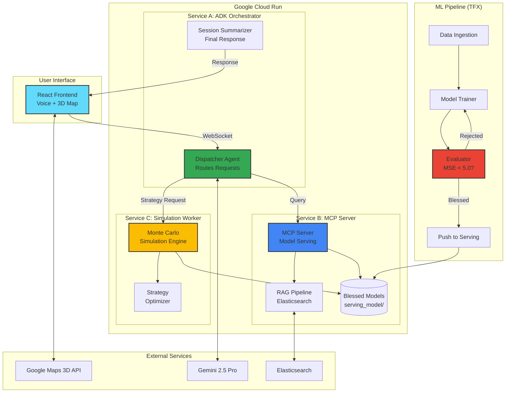

# Architecture Overview

This diagram shows the high-level architecture of Alora's multi-agent system.

## Key Components

- **Service A (ADK Orchestrator)**: Routes user requests to specialized agents
- **Service B (MCP Server)**: Serves ML models and handles RAG queries
- **Service C (Simulation Worker)**: Runs Monte Carlo simulations for race strategy
- **TFX Pipeline**: Continuous training and validation of ML models
