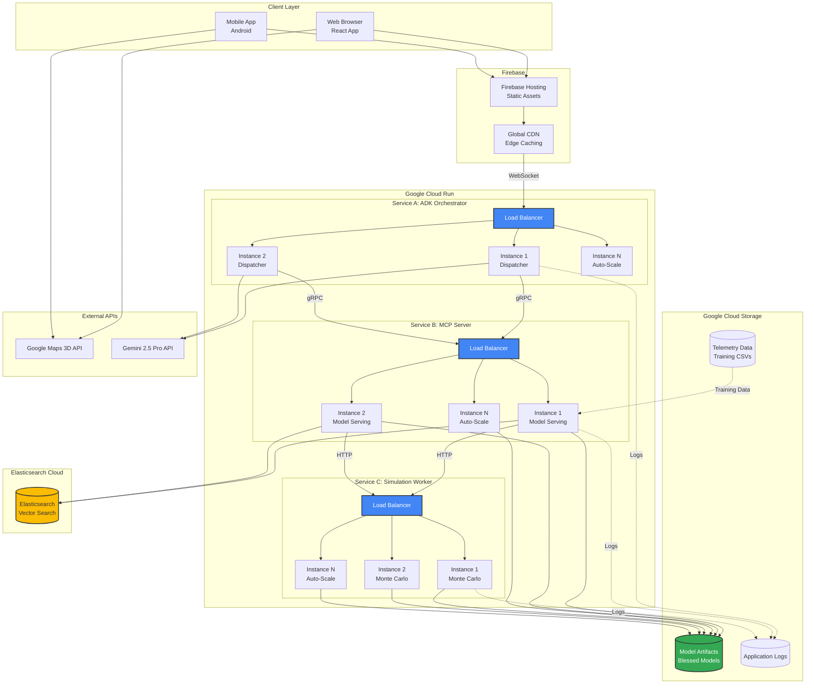

# Cloud Infrastructure

This diagram shows the Google Cloud Run deployment architecture with auto-scaling and service communication.



## Service Specifications

### Service A: ADK Orchestrator

**Purpose**: Routes user requests to specialized agents

**Configuration**:
```yaml
service: adk-orchestrator
runtime: python311
instance_class: F2  # 512MB RAM, 1 vCPU
scaling:
  min_instances: 1
  max_instances: 100
  target_cpu_utilization: 0.7
timeout: 60s
```

**Environment Variables**:
- `GEMINI_API_KEY`: Gemini 2.5 Pro authentication
- `MCP_SERVER_URL`: Internal URL to MCP Server
- `LOG_LEVEL`: INFO

**Auto-Scaling Triggers**:
- CPU > 70% → Scale up
- Request queue > 10 → Scale up
- No requests for 5 min → Scale down to min

---

### Service B: MCP Server

**Purpose**: Model serving + RAG pipeline

**Configuration**:
```yaml
service: mcp-server
runtime: python311
instance_class: F4  # 2GB RAM, 2 vCPU
scaling:
  min_instances: 2  # Always-on for low latency
  max_instances: 50
  target_cpu_utilization: 0.6
timeout: 30s
```

**Environment Variables**:
- `GCS_BUCKET`: `gs://alora-models`
- `ELASTICSEARCH_URL`: Elasticsearch Cloud endpoint
- `MODEL_CACHE_SIZE`: 3 (number of model versions to cache)

**Volume Mounts**:
- `/models` → Google Cloud Storage (read-only)

**Health Checks**:
- `/health` endpoint
- Checks: Model loaded, Elasticsearch reachable
- Interval: 10 seconds

---

### Service C: Simulation Worker

**Purpose**: CPU-intensive Monte Carlo simulations

**Configuration**:
```yaml
service: simulation-worker
runtime: python311
instance_class: C2  # CPU-optimized, 4 vCPU
scaling:
  min_instances: 0  # Scale to zero when idle
  max_instances: 20
  target_cpu_utilization: 0.8
timeout: 10s
```

**Environment Variables**:
- `MONTE_CARLO_ITERATIONS`: 1000
- `PARALLEL_WORKERS`: 4 (CPU cores)

**Optimization**:
- NumPy compiled with AVX2 instructions
- Parallel execution across cores
- Result caching for identical requests

---

## Communication Patterns

### WebSocket (Client ↔ ADK)
- **Protocol**: WSS (WebSocket Secure)
- **Purpose**: Real-time bidirectional streaming
- **Use Cases**:
  - Voice audio streaming (Gemini Live API)
  - Live telemetry updates
  - Tool call responses

### gRPC (ADK ↔ MCP)
- **Protocol**: gRPC over HTTP/2
- **Purpose**: Low-latency internal communication
- **Benefits**:
  - Binary protocol (faster than JSON)
  - Streaming support
  - Built-in load balancing

### HTTP/REST (MCP ↔ Simulation)
- **Protocol**: HTTPS
- **Purpose**: Request-response for simulations
- **Format**: JSON payloads

---

## Data Flow Example

**User Query**: "When should I pit?"

1. **Browser** → WebSocket → **Load Balancer 1**
2. **LB1** → Routes to **ADK Instance 2**
3. **ADK2** → Analyzes intent → Calls tool
4. **ADK2** → gRPC → **Load Balancer 2**
5. **LB2** → Routes to **MCP Instance 1**
6. **MCP1** → Loads models from **Cloud Storage**
7. **MCP1** → HTTP → **Load Balancer 3**
8. **LB3** → Routes to **Simulation Instance 1**
9. **SIM1** → Runs Monte Carlo (3000 iterations)
10. **SIM1** → Returns result → **MCP1**
11. **MCP1** → Returns to **ADK2**
12. **ADK2** → Session Summarizer → Natural language
13. **ADK2** → WebSocket → **Browser**

**Total Latency**: ~2.5 seconds

---

## Cost Optimization

### Auto-Scaling Strategy
- **ADK**: Always-on (1 min instance) for low latency
- **MCP**: 2 min instances (model loading is expensive)
- **Simulation**: Scale to zero (only needed for strategy queries)

### Cold Start Mitigation
- **ADK**: Keep-alive requests every 4 minutes
- **MCP**: Pre-warmed instances with models loaded
- **Simulation**: Acceptable cold start (~3s) for infrequent use

### Resource Allocation
- **ADK**: F2 (lightweight, mostly I/O)
- **MCP**: F4 (memory for model cache)
- **Simulation**: C2 (CPU-optimized for NumPy)

---

## Monitoring & Observability

**Cloud Logging**:
- All services send structured logs
- Searchable by request ID
- Retention: 30 days

**Cloud Monitoring**:
- Metrics tracked:
  - Request latency (p50, p95, p99)
  - Error rate
  - CPU/Memory utilization
  - Auto-scaling events

**Alerts**:
- Error rate > 5% → Slack notification
- Latency p95 > 5s → PagerDuty alert
- Model loading failure → Email to team

---

## Disaster Recovery

**Model Rollback**:
- Previous 3 blessed models archived in GCS
- Rollback script: `./scripts/rollback_model.sh v1.2.3`
- Automatic rollback if error rate spikes

**Database Backup**:
- Elasticsearch snapshots every 6 hours
- Retention: 7 days
- Restore time: ~15 minutes

**Service Redundancy**:
- Multi-region deployment (us-central1, us-east1)
- Automatic failover via Cloud Load Balancer
- RTO (Recovery Time Objective): < 5 minutes
