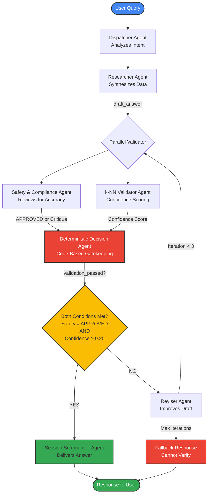

# Decision Engine Flow

This diagram illustrates the "Trust but Verify" validation pipeline that ensures every AI response meets strict safety and accuracy criteria.

## Validation Criteria

### Safety Check
- **Agent**: SafetyAndComplianceAgent
- **Output**: "APPROVED" or detailed critique
- **Purpose**: Ensures response doesn't contain dangerous advice

### Technical Confidence
- **Agent**: KnnValidatorAgent
- **Method**: k-Nearest Neighbors on automotive corpus
- **Threshold**: ≥ 0.25 confidence score
- **Purpose**: Validates terminology accuracy

### Deterministic Gate
- **Type**: Code-based (no LLM)
- **Logic**: `validation_passed = (safety == "APPROVED") AND (confidence >= 0.25)`
- **Why**: Removes probabilistic uncertainty from safety-critical decisions

## Iteration Limits

- **Max Revisions**: 3 iterations
- **Fallback**: If validation fails after 3 attempts, return "Cannot verify" response
- **Purpose**: Prevents infinite loops while maintaining safety
