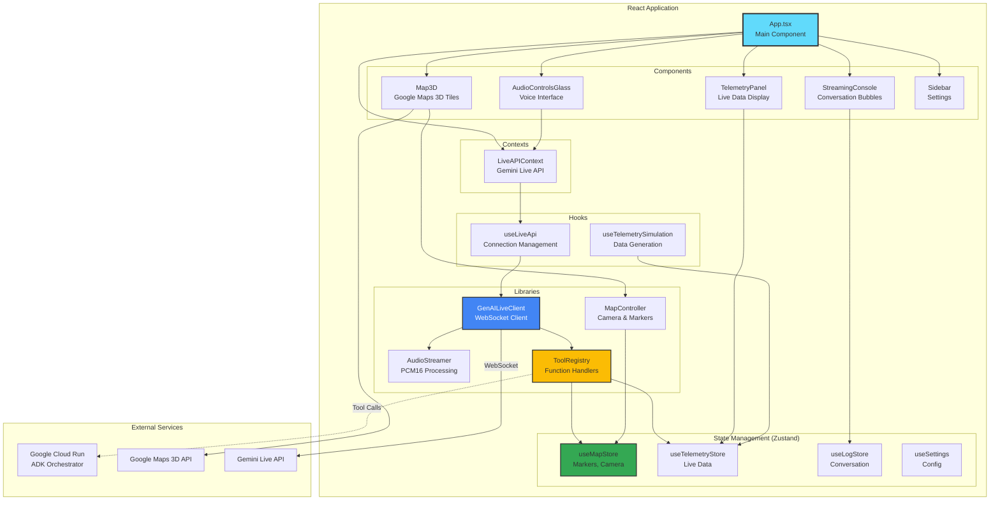

# Frontend Architecture

This diagram shows the React frontend architecture with voice interface, 3D map integration, and state management.



## Key Components

### 1. App.tsx (Main Orchestrator)

**Responsibilities**:
- Initializes all contexts and providers
- Manages global layout
- Coordinates component communication

**Key Features**:
- Responsive padding calculation for map framing
- Environment variable validation
- Effect hooks for reactive map updates

**Code Structure**:
```tsx
function App() {
  return (
    <APIProvider apiKey={GOOGLE_MAPS_API_KEY}>
      <LiveAPIProvider apiKey={API_KEY}>
        <Map3D />
        <AudioControlsGlass />
        <TelemetryPanel />
        <StreamingConsole />
      </LiveAPIProvider>
    </APIProvider>
  );
}
```

---

### 2. LiveAPIContext (Connection Management)

**Purpose**: Provides Gemini Live API connection to all components

**Exposed Values**:
```typescript
{
  client: GenAILiveClient,
  isConnected: boolean,
  isRecording: boolean,
  connect: () => Promise<void>,
  disconnect: () => void,
  sendMessage: (text: string) => void
}
```

**Tool Integration**:
- Registers tool handlers from `ToolRegistry`
- Executes tools when model requests them
- Returns results back to model

---

### 3. State Management (Zustand Stores)

**useMapStore**:
```typescript
{
  markers: MapMarker[],
  cameraTarget: Map3DCameraProps | null,
  preventAutoFrame: boolean,
  setMarkers: (markers) => void,
  setCameraTarget: (target) => void
}
```

**useTelemetryStore**:
```typescript
{
  data: {
    speed: number,
    rpm: number,
    gear: number,
    tireHealth: number,
    fuelLevel: number,
    lapDelta: number,
    carPosition: LatLngAltitude,
    ghostPosition: LatLngAltitude
  },
  updateTelemetry: (update) => void
}
```

**useLogStore**:
```typescript
{
  turns: ConversationTurn[],
  addTurn: (turn) => void,
  updateLastTurn: (update) => void,
  clearTurns: () => void
}
```

---

### 4. Map3D Component

**Purpose**: Renders Google Maps 3D Tiles with custom overlays

**Features**:
- Race track polyline rendering
- Car and ghost car markers with rotation
- Tool-driven marker placement
- Camera animations

**Integration**:
```tsx
<Map3D
  ref={setMap}
  onCameraChange={handleCameraChange}
  center={{ lat: 34.1458, lng: -83.8177, altitude: 150 }}
  range={1000}
  tilt={45}
/>
```

---

### 5. MapController (Camera & Marker Logic)

**Purpose**: Centralized controller for all map interactions

**Key Methods**:

**a. `addMarkers(markers: MapMarker[])`**
- Creates 3D markers from tool responses
- Applies glassmorphic styling
- Manages z-index layering

**b. `drawTrack(path: LatLngAltitude[])`**
- Renders race track polyline
- GR Red color with opacity
- Altitude mode: RELATIVE_TO_MESH

**c. `updateRaceCars(carPos, ghostPos, carHeading, ghostHeading)`**
- Updates car marker positions
- Rotates markers based on heading
- Custom SVG icons with drop shadows

**d. `flyTo(cameraProps: Map3DCameraProps)`**
- Animates camera to target
- 5-second smooth transition
- Respects altitude and tilt

**e. `frameEntities(entities, padding)`**
- Calculates optimal camera view
- Uses elevation service for terrain
- Applies UI padding (console, sidebar)

---

### 6. AudioStreamer (PCM16 Processing)

**Purpose**: Converts and plays audio from Gemini Live API

**Process**:
1. Receive PCM16 audio chunks (Uint8Array)
2. Convert to Float32Array (normalize to -1.0 to 1.0)
3. Queue buffers for playback
4. Schedule buffers with Web Audio API
5. Handle gaps and stuttering

**Key Features**:
- Worklet-based processing for low latency
- Automatic buffer management
- Smooth playback without gaps

---

### 7. GenAILiveClient (WebSocket Client)

**Purpose**: Manages WebSocket connection to Gemini Live API

**Event Handling**:
```typescript
client.on('open', () => console.log('Connected'));
client.on('audio', (data: ArrayBuffer) => audioStreamer.addPCM16(data));
client.on('toolcall', (call) => toolRegistry[call.name](call.args));
client.on('turncomplete', () => console.log('Model finished'));
```

**Tool Call Flow**:
1. Model requests tool (e.g., `mapsGrounding`)
2. Client looks up handler in `ToolRegistry`
3. Handler executes (updates Zustand store)
4. Client sends result back to model
5. Model incorporates result into response

---

### 8. ToolRegistry (Function Handlers)

**Purpose**: Maps tool names to implementation functions

**Registered Tools**:

**a. `mapsGrounding`**
- Fetches grounded response from Google Maps
- Extracts place details
- Updates map markers

**b. `frameEstablishingShot`**
- Geocodes location or uses lat/lng
- Sets camera target
- Triggers flyTo animation

**c. `frameLocations`**
- Frames multiple locations
- Optionally creates markers
- Calculates optimal camera view

**d. `getLiveTelemetry`**
- Reads from `useTelemetryStore`
- Returns structured JSON
- Used by AI for strategy decisions

---

## Data Flow Example

**User**: "Show me Turn 10"

1. **AudioControlsGlass** captures voice
2. **GenAILiveClient** sends audio to Gemini Live API
3. **Gemini** transcribes and understands intent
4. **Gemini** calls `frameEstablishingShot` tool with `geocode: "Turn 10, Barber Motorsports"`
5. **ToolRegistry** executes handler
6. **Handler** geocodes location → `{ lat: 33.5678, lng: -86.3456 }`
7. **Handler** calls `useMapStore.setCameraTarget()`
8. **App.tsx** `useEffect` detects `cameraTarget` change
9. **MapController.flyTo()** animates camera
10. **Map3D** updates view
11. **Gemini** responds: "Showing Turn 10 now"
12. **AudioStreamer** plays audio response

**Total Time**: ~3 seconds

---

## Performance Optimizations

### 1. Reactive State Updates
- Zustand triggers re-renders only for subscribed components
- Prevents unnecessary map redraws

### 2. Debounced Camera Updates
- Camera changes throttled to 60fps
- Prevents jank during animations

### 3. Marker Pooling
- Reuse marker elements instead of creating new ones
- Reduces DOM manipulation overhead

### 4. Audio Worklets
- Off-main-thread audio processing
- Prevents UI blocking during playback

---

## Responsive Design

### Desktop (> 768px)
- Console panel on right (25% width)
- Map on left (75% width)
- Telemetry clouds floating over map

### Mobile (≤ 768px)
- Console panel hidden by default
- Map full-screen
- Audio controls centered
- Telemetry minimized to bottom sheet

**Implementation**: CSS Media Queries and React state for different layouts
