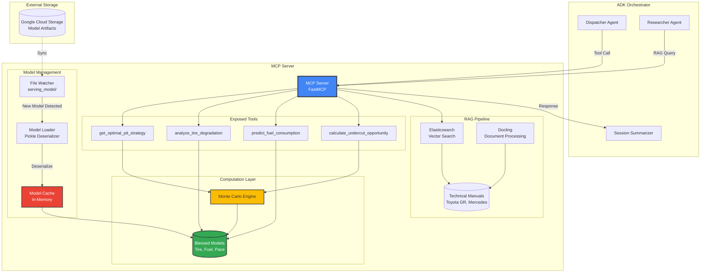

# MCP Server Architecture

This diagram shows how the Model Context Protocol (MCP) Server bridges the AI chatbot and the mathematical simulation engine.



## Server Responsibilities

### 1. Model Loading & Hot Reload

**File Watcher**:
- Monitors `serving_model/` directory for changes
- Detects new model files (`.pkl` format)
- Triggers reload automatically

**Model Loader**:
```python
def load_models():
    tire_model = pickle.load(open('serving_model/tire_degradation.pkl', 'rb'))
    fuel_model = pickle.load(open('serving_model/fuel_consumption.pkl', 'rb'))
    pace_model = pickle.load(open('serving_model/pace_prediction.pkl', 'rb'))
    return tire_model, fuel_model, pace_model
```

**Hot Reload**:
- No server restart required
- Zero downtime deployment
- Atomic swap (old models remain until new ones fully loaded)

---

### 2. Tool Exposure

MCP Server wraps complex functions into LLM-callable tools:

**Tool 1: `get_optimal_pit_strategy`**
```json
{
  "name": "get_optimal_pit_strategy",
  "description": "Calculates optimal pit stop strategy using Monte Carlo simulation",
  "parameters": {
    "total_laps": {"type": "integer", "description": "Total race laps"},
    "current_lap": {"type": "integer", "description": "Current lap number"},
    "fuel_level": {"type": "number", "description": "Fuel remaining (0-1)"},
    "tire_wear": {"type": "number", "description": "Tire wear (0-1)"}
  }
}
```

**Tool 2: `analyze_tire_degradation`**
```json
{
  "name": "analyze_tire_degradation",
  "description": "Predicts tire wear over remaining laps",
  "parameters": {
    "current_wear": {"type": "number"},
    "laps_remaining": {"type": "integer"},
    "track_temp": {"type": "number"}
  }
}
```

**Tool 3: `predict_fuel_consumption`**
```json
{
  "name": "predict_fuel_consumption",
  "description": "Estimates fuel needed for remaining laps",
  "parameters": {
    "laps_remaining": {"type": "integer"},
    "avg_rpm": {"type": "number"},
    "throttle_position": {"type": "number"}
  }
}
```

**Tool 4: `calculate_undercut_opportunity`**
```json
{
  "name": "calculate_undercut_opportunity",
  "description": "Analyzes tactical pit timing vs. rival",
  "parameters": {
    "rival_lap": {"type": "integer"},
    "rival_tire_wear": {"type": "number"},
    "gap_seconds": {"type": "number"}
  }
}
```

---

### 3. Request Handling Flow

**Example: User asks "When should I pit?"**

1. **ADK Dispatcher** receives voice query
2. **Dispatcher** routes to **MCP Server** with tool call:
   ```json
   {
     "tool": "get_optimal_pit_strategy",
     "args": {
       "total_laps": 60,
       "current_lap": 15,
       "fuel_level": 0.75,
       "tire_wear": 0.25
     }
   }
   ```
3. **MCP Server** executes `find_optimal_pit_window()`
4. **Monte Carlo Engine** runs 3000 simulations
5. **MCP Server** returns structured response:
   ```json
   {
     "strategy": "1-stop",
     "pit_lap": 28,
     "predicted_time": 5523.4,
     "confidence": 0.87
   }
   ```
6. **Session Summarizer** converts to natural language:
   > "I recommend a 1-stop strategy. Pit on Lap 28 for optimal race time."

---

### 4. RAG Pipeline Integration

**Elasticsearch Vector Search**:
- Stores technical manuals as embeddings
- Hybrid search (keyword + semantic)
- Returns top-k relevant passages

**Docling Document Processing**:
- Converts PDFs to structured text
- Preserves tables and diagrams
- Chunks documents for embedding

**Query Flow**:
```
User: "How do I activate Launch Control?"
  ↓
MCP Server → Elasticsearch
  ↓
Elasticsearch returns: [
  "Launch Control: Press brake + throttle, engage 1st gear...",
  "Prerequisites: Traction control must be in Sport+ mode..."
]
  ↓
Researcher Agent synthesizes answer
  ↓
Validation pipeline (Safety + k-NN)
  ↓
Session Summarizer delivers response
```

---

## Performance Characteristics

- **Latency**: ~2 seconds for Monte Carlo simulations
- **Throughput**: 50 requests/second (auto-scales on Cloud Run)
- **Model Load Time**: ~500ms (cached after first load)
- **Memory Usage**: ~2GB (models + cache)

---

## Error Handling

**Model Loading Failures**:
- Fallback to previous blessed model
- Alert sent to monitoring system
- Graceful degradation (return cached predictions)

**Computation Timeouts**:
- Monte Carlo simulations capped at 5 seconds
- Return partial results if timeout
- Log warning for investigation

**RAG Query Failures**:
- Retry with exponential backoff
- Fallback to cached responses
- Return "Cannot verify" if Elasticsearch unavailable
