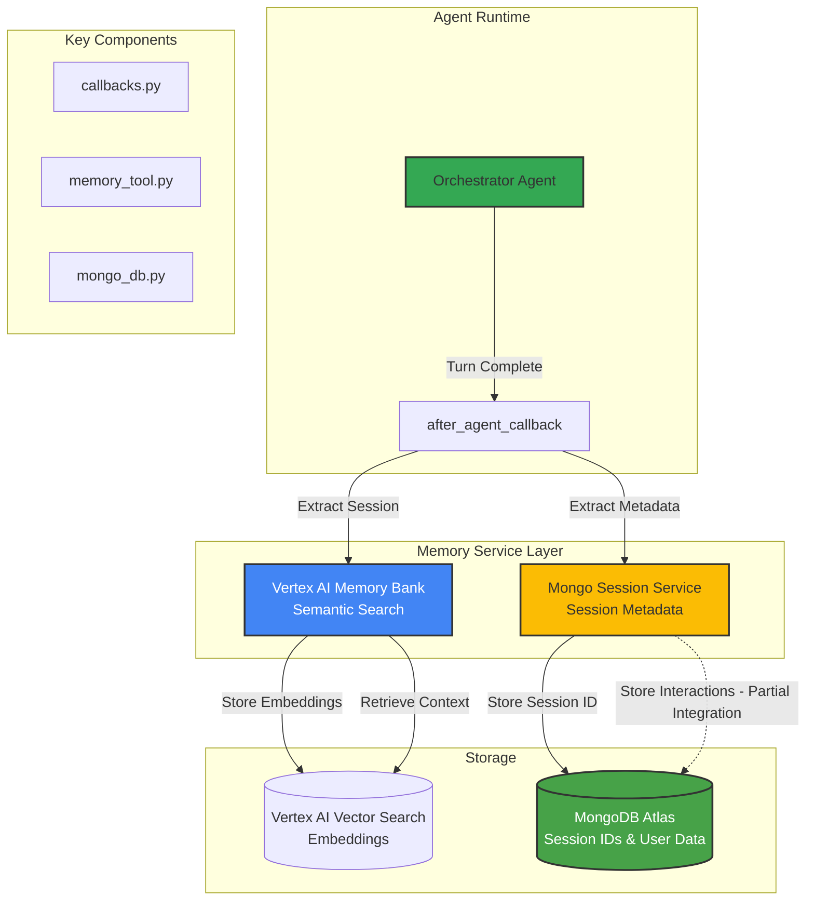

# Memory Service Architecture

This diagram illustrates the Memory Service architecture, highlighting the integration of Vertex AI for semantic memory and MongoDB for session metadata (with planned interaction history storage).

## Component Details

### 1. `callbacks.py`
- **Trigger**: `after_agent_callback`
- **Logic**: 
  - Checks if agent is `OrchestratorAgent` (critical fix)
  - Extracts `_invocation_context`
  - Calls `memory_service.add_session_to_memory()`

### 2. Vertex AI Memory Bank (`memory_tool.py`)
- **Purpose**: Long-term semantic memory
- **Function**: Stores conversation turns as vector embeddings
- **Retrieval**: Semantic search for relevant past context

### 3. Mongo Session Service (`mongo_db.py`)
- **Purpose**: Session persistence and metadata
- **Current State**: 
  - ✅ Stores Session IDs
  - ✅ Stores User IDs
  - ⚠️ Interaction history storage is partially implemented/debugged
- **Connection**: Securely retrieves URI from Google Secret Manager

## Data Flow

1. **Agent Turn Ends**: `after_agent_callback` is triggered.
2. **Context Extraction**: Callback retrieves session and memory service from invocation context.
3. **Memory Storage**:
   - **Semantic**: Conversation content sent to Vertex AI for embedding.
   - **Metadata**: Session details sent to MongoDB.
