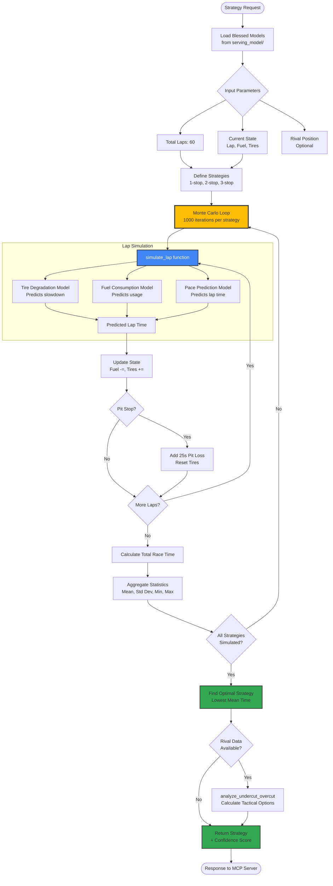

# Monte Carlo Simulation Engine

This diagram shows how the Monte Carlo simulation engine optimizes race strategy by running thousands of virtual races.



## Key Functions

### 1. `simulate_lap(lap_number, tire_wear, fuel_level)`

**Purpose**: Predicts a single lap time using trained ML models

**Process**:
1. Query **Tire Degradation Model**: How much slower due to tire wear?
2. Query **Fuel Consumption Model**: How much fuel consumed?
3. Query **Pace Prediction Model**: What's the overall lap time?

**Output**: Predicted lap time (seconds)

**Example**:
```python
lap_time = simulate_lap(
    lap_number=28,
    tire_wear=0.45,  # 45% worn
    fuel_level=0.60   # 60% remaining
)
# Returns: 92.3 seconds
```

---

### 2. `run_strategy_simulation(pit_strategy)`

**Purpose**: Simulates an entire race for a given pit strategy

**Input**:
```python
pit_strategy = {
    "stops": 1,
    "pit_laps": [28]
}
```

**Process**:
- Loop through all 60 laps
- Track fuel depletion: `fuel -= fuel_per_lap`
- Track tire wear: `tire_wear += wear_rate`
- Add pit stop time loss: `+25 seconds`
- Reset tires after pit stop

**Output**: Total race time (seconds)

---

### 3. `find_optimal_pit_window()`

**Purpose**: Runs Monte Carlo simulations to find statistically optimal strategy

**Process**:
1. Define strategies to test:
   - **1-stop**: Pit once (test laps 20-40)
   - **2-stop**: Pit twice (test various combinations)
   - **3-stop**: Pit three times
2. For each strategy:
   - Run 1000 simulations with random variations:
     - Traffic delays (±2 seconds)
     - Tire wear rate (±5%)
     - Fuel consumption (±3%)
3. Calculate statistics:
   - Mean race time
   - Standard deviation (consistency)
   - Best case / Worst case
4. Select strategy with **lowest mean time**

**Output**:
```json
{
  "strategy": "1-stop",
  "pit_lap": 28,
  "predicted_time": 5523.4,
  "confidence": 0.87,
  "alternatives": [
    {"strategy": "2-stop", "time": 5541.2, "confidence": 0.73}
  ]
}
```

---

### 4. `analyze_undercut_overcut(rival_position)`

**Purpose**: Tactical decision-making vs. competitors

**Undercut Strategy**:
- Pit **before** rival
- Gain track position with fresh tires
- Risk: Rival may stay out longer and overcut

**Overcut Strategy**:
- Pit **after** rival
- Preserve tire life while rival is in pits
- Risk: Rival gains time on fresh tires

**Calculation**:
```python
undercut_gain = (rival_tire_wear - your_tire_wear) * lap_time_delta
overcut_gain = (your_fuel_weight_advantage) * lap_time_delta
```

**Output**:
```json
{
  "recommendation": "UNDERCUT",
  "pit_now": true,
  "expected_gain": 3.2,  // seconds
  "probability_success": 0.78
}
```

---

## Monte Carlo Advantages

### 1. **Handles Uncertainty**
- Real races have random events (traffic, weather changes)
- Monte Carlo captures this variability
- Provides confidence intervals, not just point estimates

### 2. **Explores Trade-offs**
- Tire life vs. fuel weight
- Track position vs. tire freshness
- Consistency vs. aggressive strategy

### 3. **Adapts to Conditions**
- If it starts raining → models retrain → simulation adjusts
- If engine loses power → fuel model updates → strategy changes
- Self-correcting system

---

## Performance Optimization

- **Parallel Execution**: Run simulations across multiple CPU cores
- **Caching**: Cache lap predictions for identical states
- **Early Termination**: Stop if strategy is clearly suboptimal
- **Typical Runtime**: ~2 seconds for 3000 simulations (1000 per strategy)
