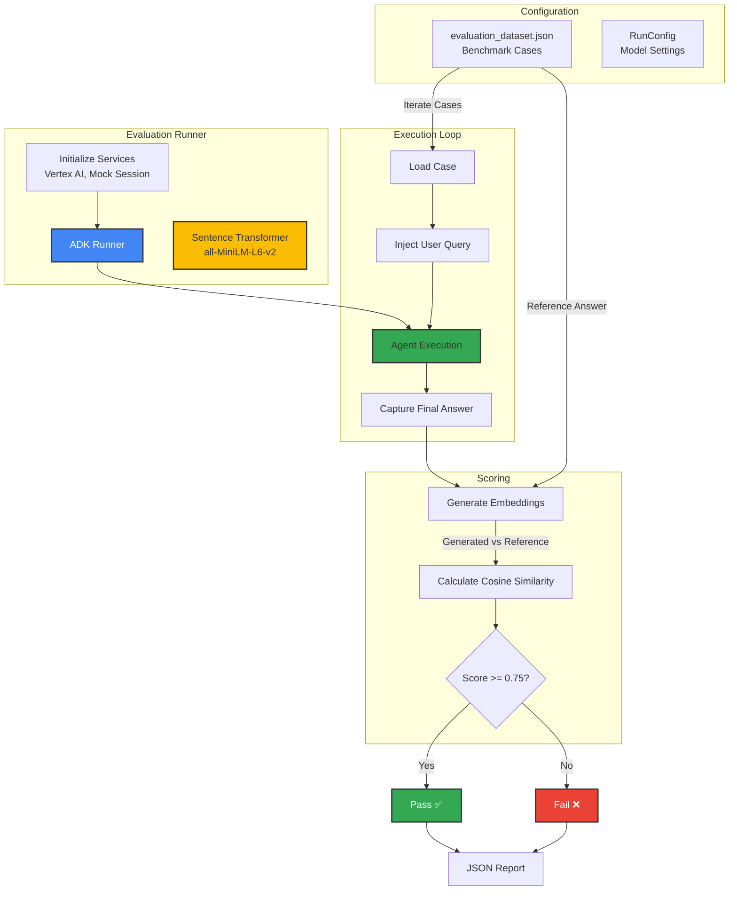

# Prompt Evaluation Pipeline

This diagram shows the automated evaluation pipeline for testing agent prompts against a benchmark dataset.



## Pipeline Steps

### 1. Initialization (`benchmark_prompts.py`)
- Sets up `VertexAiMemoryBankService`
- Creates `MockSessionService` (isolates tests from production DB)
- Initializes `SentenceTransformer` model for semantic comparison

### 2. Execution
- Iterates through `evaluation_dataset.json`
- **Input**: `user_query` (e.g., "How does MBUX Hyperscreen work?")
- **Process**: Runs agent with `Runner.run_async()`
- **Output**: Captures the final text response

### 3. Semantic Scoring
- **Model**: `all-MiniLM-L6-v2` (Hugging Face)
- **Method**: 
  1. Encode `generated_answer` to vector
  2. Encode `reference_answer` to vector
  3. Calculate **Cosine Similarity**
- **Threshold**: 0.75 (configurable)

### 4. Reporting
- Outputs JSON report with:
  - User Query
  - Generated Answer
  - Reference Answer
  - Similarity Score
  - Pass/Fail Status

## Dataset Structure

```json
{
  "eval_cases": [
    {
      "eval_id": "case001",
      "user_query": "...",
      "reference_answer": "..."
    }
  ]
}
```
