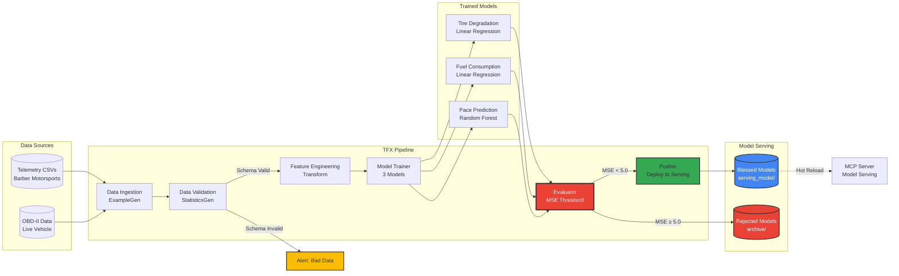

# TFX Pipeline

This diagram shows the TensorFlow Extended (TFX) continuous training pipeline that keeps ML models accurate as conditions change.

## Pipeline Components

### 1. Data Ingestion (ExampleGen)
- **Input**: Raw telemetry CSVs from Barber Motorsports Park dataset
- **Process**: Reads and splits data into train/eval sets
- **Output**: TFRecord format for efficient processing

### 2. Data Validation (StatisticsGen)
- **Purpose**: Detects anomalies and schema violations
- **Checks**:
  - Missing values
  - Out-of-range values (e.g., negative fuel)
  - Schema drift
- **Action**: Alerts if data quality issues detected

### 3. Feature Engineering (Transform)
- **Transformations**:
  - Rolling averages (e.g., avg speed over last 3 laps)
  - Normalization (scale features to 0-1 range)
  - Derived features (e.g., tire wear rate)
- **Output**: Preprocessed features ready for training

### 4. Model Trainer
Trains three specialized models simultaneously:

**a. Tire Degradation Model**
- **Algorithm**: Linear Regression
- **Features**: Lap count, lateral G-force, track temp
- **Target**: Lap time slowdown (seconds)

**b. Fuel Consumption Model**
- **Algorithm**: Linear Regression
- **Features**: RPM, throttle position, gear
- **Target**: Fuel usage per lap (liters)

**c. Pace Prediction Model**
- **Algorithm**: Random Forest (100 trees)
- **Features**: Traffic, gear, braking intensity, tire wear
- **Target**: Overall lap time (seconds)

### 5. Evaluator (Quality Gate)
- **Metric**: Mean Squared Error (MSE)
- **Threshold**: MSE < 5.0
- **Decision**:
  - **Pass**: Model marked as "Blessed" → Deploy to production
  - **Fail**: Model rejected → Keep using previous version
- **Why**: Prevents bad models from reaching production

### 6. Pusher (Deployment)
- **Action**: Copies blessed models to `serving_model/` directory
- **Trigger**: MCP Server hot-reloads new models automatically
- **Rollback**: Previous models archived for safety

## Automation

- **Trigger**: New data arrival or scheduled (daily)
- **Execution**: Cloud Run job
- **Monitoring**: Logs sent to Cloud Logging
- **Alerts**: Slack notification on pipeline failure
