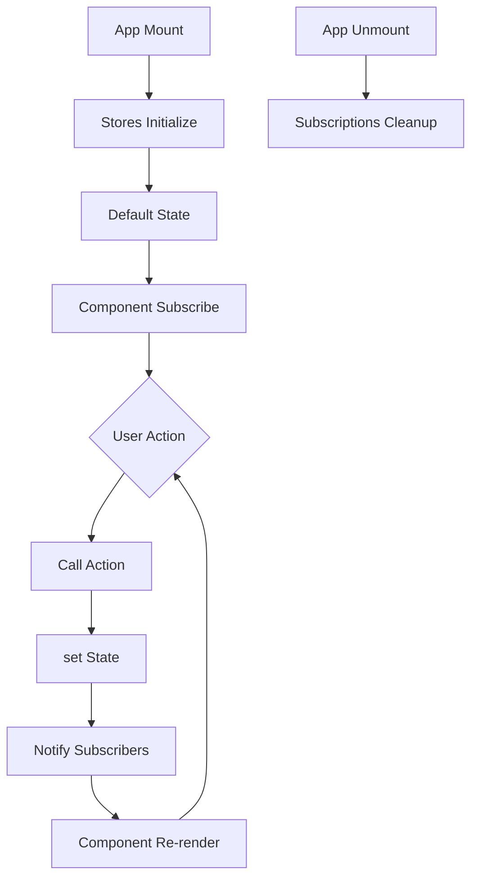

# State Management Documentation

## Overview

Alora uses **Zustand** for state management - a lightweight, un-opinionated state library that doesn't require providers or complex boilerplate. Each feature domain has its own store with clearly defined state and actions.

---

## Store Architecture

### Store Pattern

All stores follow a consistent pattern:

```typescript
import { create } from 'zustand';

interface StoreState {
  // Data
  value: Type;
  
  // Actions (mutations)
  setValue: (newValue: Type) => void;
  resetValue: () => void;
}

export const useStore = create<StoreState>((set, get) => ({
  // Initial state
  value: initialValue,
  
  // Actions
  setValue: (newValue) => set({ value: newValue }),
  resetValue: () => set({ value: initialValue }),
  
  // Computed values (if needed)
  getComputedValue: () => {
    const state = get();
    return computeValue(state.value);
  }
}));
```

---

## Core Stores

### 1. Map Store

**Location:** `lib/state/map-state.ts`

**Purpose:** Manage map markers, camera position, and viewport state

**Interface:**
```typescript
interface MapState {
  // State
  markers: Marker[];
  cameraTarget: CameraTarget | null;
  preventAutoFrame: boolean;
  
  // Actions
  addMarker: (marker: Marker) => void;
  removeMarker: (id: string) => void;
  clearMarkers: () => void;
  setCameraTarget: (target: CameraTarget | null) => void;
  setPreventAutoFrame: (prevent: boolean) => void;
}

interface Marker {
  id: string;
  position: { lat: number; lng: number };
  label?: string;
  color?: string;
}

interface CameraTarget {
  latitude: number;
  longitude: number;
  altitude?: number;
}
```

**Usage:**
```tsx
// Subscribe to specific state
const markers = useMapStore(state => state.markers);

// Imperative access in tool handlers
const addMarker = (marker: Marker) => {
  useMapStore.getState().addMarker(marker);
};

// Subscribe to multiple values
const { cameraTarget, setCameraTarget } = useMapStore();
```

**Integration:**
- Map markers rendered by `MapController`
- Camera updates trigger `Map3D` re-render via `viewProps`

---

### 2. Telemetry Store

**Location:** `lib/state/telemetry-state.ts`

**Purpose:** Store and update racing telemetry data

**Interface:**
```typescript
interface TelemetryState {
  // State
  data: TelemetryData;
  isSimulating: boolean;
  
  // Actions
  setData: (data: Partial<TelemetryData>) => void;
  resetData: () => void;
  startSimulation: () => void;
  stopSimulation: () => void;
}

interface TelemetryData {
  speed: number;           // MPH
  gear: number;            // 1-6, N, R
  rpm: number;             // Engine RPM
  lapDelta: number;        // Seconds (+/-)
  fuelLevel: number;       // Percentage
  tireHealth: number;      // Percentage
  trackPath?: google.maps.LatLng[];
  carPosition?: { lat: number; lng: number };
}
```

**Default Values:**
```typescript
const DEFAULT_TELEMETRY: TelemetryData = {
  speed: 0,
  gear: 1,
  rpm: 1000,
  lapDelta: 0.0,
  fuelLevel: 100,
  tireHealth: 100,
  trackPath: undefined,
  carPosition: undefined
};
```

**Simulation:**
```tsx
// hooks/use-telemetry-simulation.ts
export function useTelemetrySimulation() {
  useEffect(() => {
    const interval = setInterval(() => {
      const newData = {
        speed: Math.random() * 180,
        gear: Math.floor(Math.random() * 6) + 1,
        rpm: 3000 + Math.random() * 4000,
        lapDelta: (Math.random() - 0.5) * 2,
        fuelLevel: Math.max(0, Math.random() * 100),
        tireHealth: Math.max(0, Math.random() * 100)
      };
      useTelemetryStore.getState().setData(newData);
    }, 500);
    
    return () => clearInterval(interval);
  }, []);
}
```

---

### 3. UI Store

**Location:** `lib/state/ui-state.ts`

**Purpose:** Manage UI visibility states and modes

**Interface:**
```typescript
interface UIState {
  // Sidebar
  isSidebarOpen: boolean;
  toggleSidebar: () => void;
  
  // Telemetry Panel
  isTelemetryPanelOpen: boolean;
  toggleTelemetryPanel: () => void;
  
  // Other UI states
  currentView: 'map' | 'list';
  setCurrentView: (view: 'map' | 'list') => void;
}
```

**Usage:**
```tsx
// Component
function ControlTray() {
  const { toggleSidebar, toggleTelemetryPanel } = useUI();
  
  return (
    <button onClick={toggleSidebar}>Settings</button>
    <button onClick={toggleTelemetryPanel}>Toggle Telemetry</button>
  );
}
```

---

### 4. Log Store

**Location:** `lib/state/log-store.ts`

**Purpose:** Store conversation history and chat messages

**Interface:**
```typescript
interface LogStore {
  // State
  turns: ConversationTurn[];
  showSystemMessages: boolean;
  
  // Actions
  addTurn: (turn: ConversationTurn) => void;
  updateTurn: (index: number, updates: Partial<ConversationTurn>) => void;
  clearTurns: () => void;
  setShowSystemMessages: (show: boolean) => void;
}

interface ConversationTurn {
  role: 'user' | 'agent' | 'system';
  text: string;
  timestamp?: number;
  isFinal?: boolean;
  toolOutput?: ToolOutput;
}

interface ToolOutput {
  type: 'station_list' | 'battery_status' | 'error';
  data: any;
}
```

**Turn Management:**
```tsx
// Add user message
useLogStore.getState().addTurn({
  role: 'user',
  text: 'Find charging stations',
  timestamp: Date.now(),
  isFinal: true
});

// Add agent response (incremental)
useLogStore.getState().addTurn({
  role: 'agent',
  text: 'I found 5 stations...',
  isFinal: false
});

// Update with final response
const turns = useLogStore.getState().turns;
useLogStore.getState().updateTurn(turns.length - 1, {
  text: 'I found 5 stations nearby.',
  isFinal: true
});
```

**Integration:**
- `StreamingConsole` displays latest turn
- `DebugPanel` shows all turns with filtering

---

### 5. EV Mode Store

**Location:** `lib/state/ev-mode-state.ts`

**Purpose:** Manage EV charging feature state

**Interface:**
```typescript
interface EVModeState {
  // Mode
  isEVMode: boolean;
  toggleEVMode: () => void;
  
  // Vehicle
  vehicleProfile: EVVehicleProfile | null;
  setVehicleProfile: (profile: EVVehicleProfile) => void;
  
  // Stations
  nearbyStations: ChargingStation[];
  setNearbyStations: (stations: ChargingStation[]) => void;
  
  // Navigation
  routePath: google.maps.LatLng[] | null;
  setRoutePath: (path: google.maps.LatLng[] | null) => void;
  
  // Location
  userLocation: GeolocationCoordinates | null;
  setUserLocation: (location: GeolocationCoordinates | null) => void;
  
  // Cleanup
  clearEVData: () => void;
}
```

**Mode Switching:**
```tsx
const { isEVMode, toggleEVMode, clearEVData } = useEVModeStore();

const handleToggle = () => {
  if (isEVMode) {
    clearEVData(); // Clean up EV-specific data
  }
  toggleEVMode();
};
```

**Data Flow:**
1. User toggles EV mode
2. Tool registry updates based on mode
3. System prompt includes EV-specific instructions
4. UI shows/hides EV components

---

### 6. Settings Store

**Location:** `lib/state/settings-state.ts`

**Purpose:** User preferences and configuration

**Interface:**
```typescript
interface SettingsState {
  // Model config
  model: string;
  setModel: (model: string) => void;
  
  // Voice config
  voice: string;
  setVoice: (voice: string) => void;
  
  // System preferences
  showSystemMessages: boolean;
  setShowSystemMessages: (show: boolean) => void;
  
  // API keys (if user-provided)
  apiKey: string | null;
  setApiKey: (key: string | null) => void;
}
```

**Persistence:**
```tsx
// Save to localStorage
const settingsStore = create<SettingsState>()(
  persist(
    (set) => ({
      model: 'gemini-2.5-flash-native-audio-preview-09-2025',
      voice: 'Aoede',
      setModel: (model) => set({ model }),
      setVoice: (voice) => set({ voice })
    }),
    {
      name: 'alora-settings',
      storage: createJSONStorage(() => localStorage)
    }
  )
);
```

---

## Advanced Patterns

### Computed Values

**Pattern 1: Inside Store**
```typescript
const useStore = create<State>((set, get) => ({
  value: 0,
  increment: () => set(state => ({ value: state.value + 1 })),
  
  // Computed
  getDoubleValue: () => {
    return get().value * 2;
  }
}));

// Usage
const doubleValue = useStore(state => state.getDoubleValue());
```

**Pattern 2: Custom Hook**
```tsx
function useComputedValue() {
  const value = useStore(state => state.value);
  return useMemo(() => value * 2, [value]);
}
```

### Subscriptions

**Listen to specific changes:**
```tsx
useEffect(() => {
  const unsubscribe = useTelemetryStore.subscribe(
    (state) => state.data.speed,
    (speed) => {
      console.log('Speed changed:', speed);
    }
  );
  
  return unsubscribe;
}, []);
```

### Middleware

**Logger Middleware:**
```typescript
import { create } from 'zustand';
import { devtools } from 'zustand/middleware';

const useStore = create<State>()(
  devtools(
    (set) => ({
      value: 0,
      setValue: (value) => set({ value }, false, 'setValue')
    }),
    { name: 'MyStore' }
  )
);
```

**Persist Middleware:**
```typescript
import { persist, createJSONStorage } from 'zustand/middleware';

const useStore = create<State>()(
  persist(
    (set) => ({
      value: 0,
      setValue: (value) => set({ value })
    }),
    {
      name: 'storage-key',
      storage: createJSONStorage(() => localStorage)
    }
  )
);
```

---

## Store Communication

### Cross-Store Updates

**Anti-pattern:** Stores importing other stores
```tsx
// ❌ Don't do this
const useStoreA = create((set) => ({
  updateB: () => {
    useStoreB.getState().setValue(123); // Tight coupling
  }
}));
```

**Better:** Event emitter or shared action
```tsx
// ✅ Decouple with events
const eventBus = new EventEmitter();

const useStoreA = create((set) => ({
  triggerUpdate: () => {
    eventBus.emit('updateB', 123);
  }
}));

const useStoreB = create((set) => ({
  value: 0,
  initialize: () => {
    eventBus.on('updateB', (newValue) => {
      set({ value: newValue });
    });
  }
}));
```

**Best:** Tool handlers coordinate
```tsx
// ✅ Tool handler as mediator
const handleAction = () => {
  const { value } = useStoreA.getState();
  useStoreB.getState().setValue(value);
  useStoreC.getState().update(value);
};
```

---

## React Integration

### Component Subscriptions

**Selective subscription:**
```tsx
// Only re-renders when speed changes
function SpeedDisplay() {
  const speed = useTelemetryStore(state => state.data.speed);
  return <div>{speed} MPH</div>;
}
```

**Multiple values:**
```tsx
// Re-renders when either changes
function Telemetry() {
  const { speed, gear } = useTelemetryStore(
    state => ({ speed: state.data.speed, gear: state.data.gear })
  );
  return <div>{speed} MPH, Gear {gear}</div>;
}
```

**Shallow comparison:**
```tsx
import { shallow } from 'zustand/shallow';

function Component() {
  const { a, b } = useStore(
    state => ({ a: state.a, b: state.b }),
    shallow
  );
}
```

### Hook-Based Actions

**Pattern:**
```tsx
function Component() {
  const setValue = useStore(state => state.setValue);
  
  // setValue is stable, won't cause re-renders
  useEffect(() => {
    setValue(123);
  }, [setValue]);
}
```

---

## Testing

### Store Testing

```tsx
import { renderHook, act } from '@testing-library/react';
import { useTelemetryStore } from '../state/telemetry-state';

describe('useTelemetryStore', () => {
  beforeEach(() => {
    // Reset store before each test
    useTelemetryStore.getState().resetData();
  });
  
  it('updates telemetry data', () => {
    const { result } = renderHook(() => useTelemetryStore());
    
    act(() => {
      result.current.setData({ speed: 120, gear: 4 });
    });
    
    expect(result.current.data.speed).toBe(120);
    expect(result.current.data.gear).toBe(4);
  });
  
  it('resets to defaults', () => {
    const { result } = renderHook(() => useTelemetryStore());
    
    act(() => {
      result.current.setData({ speed: 120 });
      result.current.resetData();
    });
    
    expect(result.current.data.speed).toBe(0);
  });
});
```

---

## Performance

### Optimization Tips

1. **Selective subscriptions:** Only subscribe to needed state
```tsx
// ✅ Good
const speed = useStore(state => state.data.speed);

// ❌ Bad (re-renders on any state change)
const state = useStore();
```

2. **Computed values:** Use `useMemo` or store getters
```tsx
const doubleValue = useMemo(() => value * 2, [value]);
```

3. **Batch updates:** Combine multiple `set` calls
```tsx
// Instead of:
set({ a: 1 });
set({ b: 2 });

// Do:
set({ a: 1, b: 2 });
```

4. **Immer for nested updates:**
```typescript
import { immer } from 'zustand/middleware/immer';

const useStore = create<State>()(
  immer((set) => ({
    nested: { deep: { value: 0 } },
    updateNested: (newValue) => set((state) => {
      state.nested.deep.value = newValue; // Immer handles immutability
    })
  }))
);
```

---

## Migration Guide

### From Redux

**Redux:**
```tsx
// Action
const increment = () => ({ type: 'INCREMENT' });

// Reducer
function reducer(state, action) {
  switch (action.type) {
    case 'INCREMENT':
      return { count: state.count + 1 };
  }
}

// Component
const count = useSelector(state => state.count);
```

**Zustand:**
```tsx
// Store
const useStore = create((set) => ({
  count: 0,
  increment: () => set(state => ({ count: state.count + 1 }))
}));

// Component
const count = useStore(state => state.count);
const increment = useStore(state => state.increment);
```

### From Context

**Context:**
```tsx
const CountContext = createContext();

function Provider({ children }) {
  const [count, setCount] = useState(0);
  return (
    <CountContext.Provider value={{ count, setCount }}>
      {children}
    </CountContext.Provider>
  );
}
```

**Zustand:**
```tsx
const useCountStore = create((set) => ({
  count: 0,
  setCount: (count) => set({ count })
}));

// No provider needed!
function App() {
  return <Component />;
}
```

---

## Best Practices

1. **One store per domain:** Don't create a monolithic global store
2. **Actions over direct mutation:** Use `set()` via action functions
3. **Avoid derived state:** Compute on-the-fly or use getters
4. **Type everything:** Use TypeScript interfaces for store state
5. **Selective subscriptions:** Only subscribe to what you need
6. **Imperative access:** Use `getState()` in event handlers/tools
7. **Cleanup:** Reset stores when features are disabled

---

## Store Lifecycle



---

## Future Enhancements

- [ ] Persist critical state to IndexedDB
- [ ] Add undo/redo middleware
- [ ] Time-travel debugging (devtools)
- [ ] State snapshots for testing
- [ ] Cross-tab synchronization
